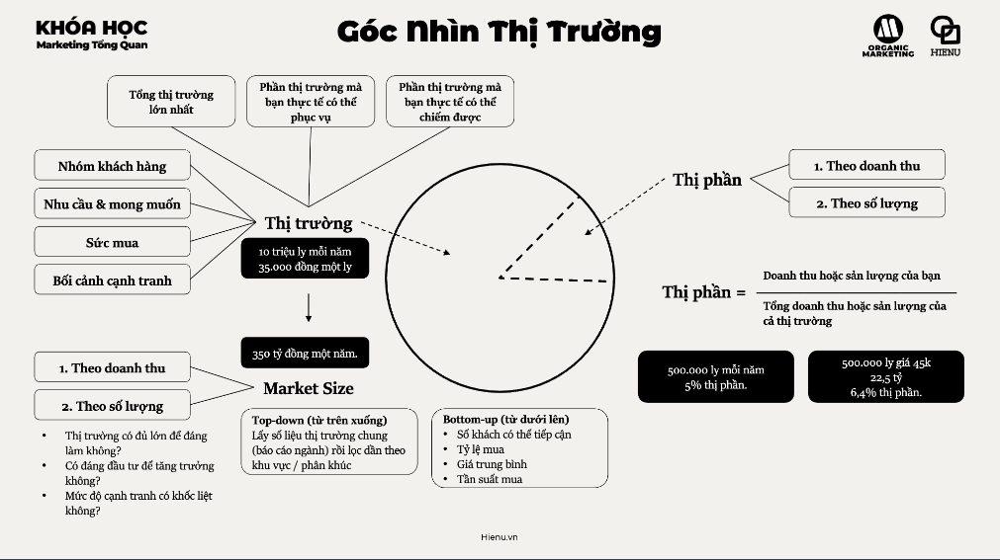

# Nhóm khách hàng
- [Nhóm khách hàng](./2.Nhóm%20khách%20hàng.md)

# Nhu cầu và mong muốn
- [Nhu cầu và mong muốn](./3.Nhu%20cầu%20và%20mong%20muốn.md)

# Sức mua
- [Sức mua](./4.Sức%20Mua.md)

# Bối cảnh cạnh tranh
- [Bối cảnh cạnh tranh](./5.Bối%20Cảnh%20cạnh%20tranh.md)

# Market size
- [Market size](./6.Market%20size.md)

# Thị phần
- [Thị phần](./7.Thị%20Phần.md)