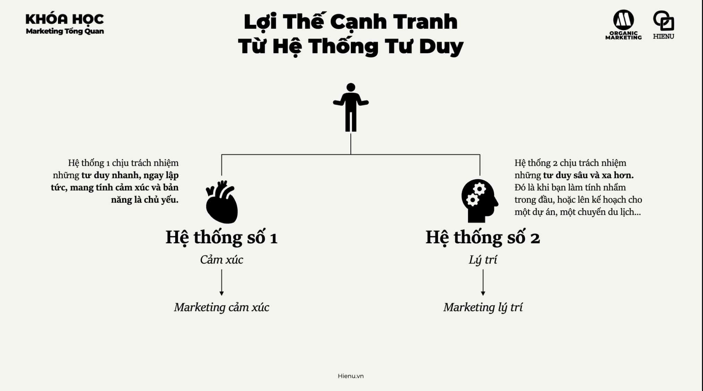
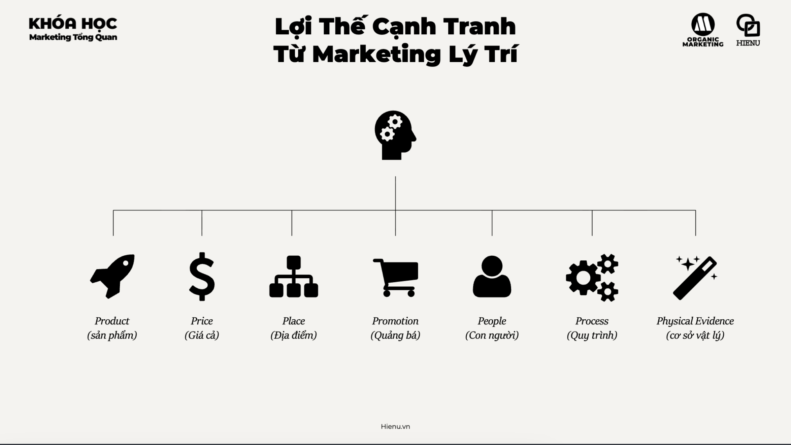

# Lợi thế cạnh tranh tâm lý


<br>



# LỢI THẾ CẠNH TRANH, MARKETING CẢM XÚC VÀ MARKETING LÝ TRÍ — HỆ THỐNG TƯ DUY CMO 20 NĂM

# 1. SAI LẦM LỚN NHẤT CỦA DOANH NGHIỆP

Nghĩ rằng:

> Khách hàng mua vì sản phẩm tốt hơn.

---

# Reality

Khách hàng mua vì:

- nhận thức tốt hơn
- cảm xúc mạnh hơn
- niềm tin cao hơn
- ít rủi ro hơn

---

# Thị trường đầy ví dụ

Sản phẩm tốt nhất:

≠

Thương hiệu dẫn đầu.

---

# Vì sao?

Vì khách hàng không nhìn thấy toàn bộ sự thật.

---

Họ chỉ nhìn thấy:

- điều họ biết
- điều họ tin
- điều họ cảm nhận

---

# Rule quan trọng

> Marketing không tạo ra sản phẩm tốt.
>
> Marketing tạo ra lý do để khách hàng chọn bạn.

---

# 2. LỢI THẾ CẠNH TRANH THẬT SỰ LÀ GÌ?

Sai lầm phổ biến:

Nghĩ lợi thế cạnh tranh là:

- nhiều tính năng hơn
- giá rẻ hơn
- công nghệ tốt hơn

---

# Reality

Đó thường chỉ là lợi thế tạm thời.

---

# Vì đối thủ có thể copy.

---

# CMO luôn nhìn lợi thế cạnh tranh theo 5 tầng.

---

# TẦNG 1 — PRODUCT ADVANTAGE

## Lợi thế sản phẩm

Ví dụ:

- nhanh hơn
- rẻ hơn
- bền hơn

---

# Đây là tầng yếu nhất.

---

Vì dễ bị copy.

---

# Ví dụ

Một tính năng AI mới.

---

6 tháng sau.

---

Cả thị trường đều có.

---

# TẦNG 2 — OPERATIONAL ADVANTAGE

## Lợi thế vận hành

Ví dụ:

- giao hàng nhanh
- chi phí thấp
- supply chain mạnh

---

# Ví dụ

:contentReference[oaicite:0]{index=0}

---

Lợi thế lớn không phải website.

---

Mà là logistics.

---

# TẦNG 3 — DATA ADVANTAGE

## Lợi thế dữ liệu

---

Ví dụ

Càng nhiều khách hàng.

↓

Càng nhiều dữ liệu.

↓

Càng tối ưu tốt hơn.

---

# Đây là lợi thế khó copy hơn.

---

# TẦNG 4 — ECOSYSTEM ADVANTAGE

## Lợi thế hệ sinh thái

---

Ví dụ

:contentReference[oaicite:1]{index=1}

---

Không chỉ bán:

- điện thoại

---

Mà bán:

- iPhone
- Mac
- Watch
- AirPods
- iCloud

---

# Khi khách hàng vào hệ sinh thái.

Chi phí rời đi tăng mạnh.

---

# TẦNG 5 — BRAND ADVANTAGE

## Lợi thế thương hiệu

---

Đây là tầng mạnh nhất.

---

# Ví dụ

Hai sản phẩm tương đương.

---

Khách hàng vẫn chọn thương hiệu họ tin.

---

# Vì

Brand làm giảm rủi ro nhận thức.

---

# 3. HỆ THỐNG TƯ DUY LỢI THẾ CẠNH TRANH

# CMO không hỏi

"Sản phẩm có tốt không?"

---

# CMO hỏi

"Tại sao khách hàng phải chọn chúng ta?"

---

# Và

"Tại sao đối thủ không thể copy?"

---

# Nếu đối thủ copy trong 3 tháng

=> Không phải lợi thế cạnh tranh.

---

# Nếu đối thủ copy trong 3 năm vẫn khó

=> Có thể là lợi thế cạnh tranh.

---

# 4. MARKETING CẢM XÚC (EMOTIONAL MARKETING)

# Bản chất

Marketing cảm xúc là:

> kích hoạt cảm xúc để tạo hành động.

---

# Vì sao hiệu quả?

Não người có hai hệ thống.

---

# System 1

Nhanh.

Cảm xúc.

Bản năng.

---

# System 2

Chậm.

Logic.

Phân tích.

---

# Phần lớn quyết định mua

Bắt đầu ở System 1.

---

# Rule

Emotion drives action.

Logic justifies action.

---

# 5. CÁC CẢM XÚC PHỔ BIẾN TRONG MARKETING

# Tình yêu

---

# Hạnh phúc

---

# Hy vọng

---

# Thành công

---

# Tự hào

---

# An toàn

---

# Sợ hãi

---

# Khao khát

---

# Thuộc về

---

# Ví dụ

Bảo hiểm.

---

Không bán hợp đồng.

---

Bán cảm giác an tâm.

---

# Ví dụ

Khóa học.

---

Không bán video.

---

Bán tương lai tốt đẹp hơn.

---

# 6. MARKETING CẢM XÚC BÁN CÁI GÌ?

Không bán:

Sản phẩm.

---

Mà bán:

# Feeling

---

# Identity

---

# Transformation

---

# Ví dụ

Nike không bán giày.

---

Bán:

"Tôi là người chiến thắng."

---

# Ví dụ

Gym không bán máy tập.

---

Bán:

"Phiên bản tốt hơn của bản thân."

---

# 7. KHI NÀO MARKETING CẢM XÚC HIỆU QUẢ NHẤT?

# Luxury

---

# Thời trang

---

# Mỹ phẩm

---

# Xe hơi

---

# Du lịch

---

# Giáo dục

---

# Fitness

---

# Lifestyle

---

# Vì

Quyết định mang tính cảm xúc cao.

---

# 8. MARKETING LÝ TRÍ (RATIONAL MARKETING)

# Bản chất

Marketing lý trí là:

> thuyết phục bằng dữ liệu và logic.

---

# Tập trung vào

- ROI
- hiệu suất
- tính năng
- chi phí
- lợi ích

---

# Ví dụ

CRM giúp:

- tăng 30% conversion
- giảm 50% thời gian xử lý

---

# Đây là lý trí.

---

# 9. KHI NÀO MARKETING LÝ TRÍ HIỆU QUẢ?

# B2B

---

# SaaS

---

# ERP

---

# Cybersecurity

---

# Logistics

---

# Thiết bị công nghiệp

---

# Vì

Rủi ro cao.

---

Người mua cần lý do hợp lý.

---

# 10. SAI LẦM PHỔ BIẾN

# Chỉ dùng cảm xúc

---

Khách hàng thích.

---

Nhưng không mua.

---

# Chỉ dùng lý trí

---

Khách hàng hiểu.

---

Nhưng không hành động.

---

# Reality

Khách hàng cần cả hai.

---

# 11. MÔ HÌNH QUYẾT ĐỊNH THỰC TẾ

```text
Emotion
↓
Interest
↓
Desire
↓
Logic
↓
Justification
↓
Purchase
```

---

# Ví dụ mua xe

# Cảm xúc

"Tôi thích chiếc xe này."

---

# Logic

- tiết kiệm xăng
- bảo hành tốt
- giá hợp lý

---

# Mua hàng

---

# Nếu thiếu cảm xúc

Không thích.

---

# Nếu thiếu logic

Không dám mua.

---

# 12. CMO GIỎI KẾT HỢP NHƯ THẾ NÀO?

# Emotional Hook

Thu hút.

---

# Rational Proof

Thuyết phục.

---

# Ví dụ

Quảng cáo:

"Giúp bạn lấy lại 10 giờ mỗi tuần."

---

Sau đó:

- case study
- số liệu
- ROI

---

# Đây là công thức phổ biến nhất.

---

# 13. FRAMEWORK CMO

# STEP 1

Khách hàng muốn cảm thấy gì?

---

# STEP 2

Khách hàng sợ điều gì?

---

# STEP 3

Khách hàng muốn trở thành ai?

---

# STEP 4

Bằng chứng nào khiến họ tin?

---

# STEP 5

ROI nào khiến họ ra quyết định?

---

# STEP 6

Điều gì khiến họ kể cho người khác?

---

# 14. NHỮNG LỖI CHẾT NGƯỜI

# 14.1 CẠNH TRANH BẰNG GIÁ

---

# 14.2 COI TÍNH NĂNG LÀ LỢI THẾ

---

# 14.3 KHÔNG XÂY THƯƠNG HIỆU

---

# 14.4 CHỈ BÁN CẢM XÚC

---

# 14.5 CHỈ BÁN LOGIC

---

# 14.6 KHÔNG CÓ PROOF

---

# 14.7 KHÔNG HIỂU ĐỘNG CƠ THẬT

---

# 14.8 KHÔNG HIỂU TÂM LÝ KHÁCH HÀNG

---

# 15. MENTAL MODEL QUAN TRỌNG

# FEATURES ARE COPIED

---

# BRAND IS DEFENDED

---

# EMOTION CREATES DEMAND

---

# LOGIC CLOSES SALES

---

# TRUST REDUCES RISK

---

# IDENTITY DRIVES CONSUMPTION

---

# PEOPLE BUY BETTER FUTURES

---

# KẾT LUẬN

CMO giỏi hiểu rằng:

> Khách hàng không mua sản phẩm vì nó tốt.

Họ mua vì:

- nó khiến họ cảm thấy tốt hơn
- nó giúp họ đạt mục tiêu
- nó giảm nỗi sợ
- nó củng cố hình ảnh bản thân

Do đó:

Marketing mạnh nhất là sự kết hợp giữa:

```text
Emotion
+
Trust
+
Proof
+
Logic
```

Và lợi thế cạnh tranh mạnh nhất không phải là:

- tính năng
- công nghệ
- giá

Mà là:

- thương hiệu
- dữ liệu
- hệ sinh thái
- cộng đồng
- và niềm tin mà khách hàng dành cho doanh nghiệp.