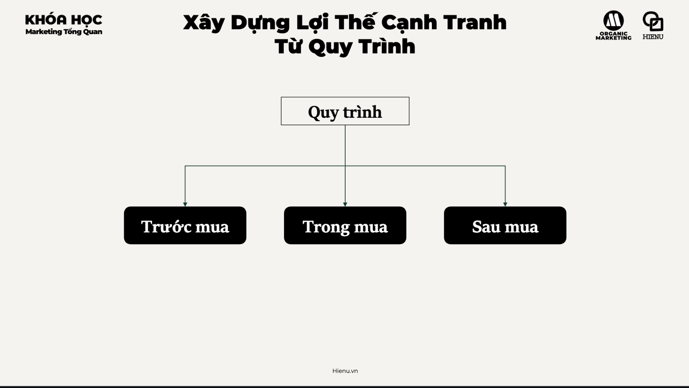
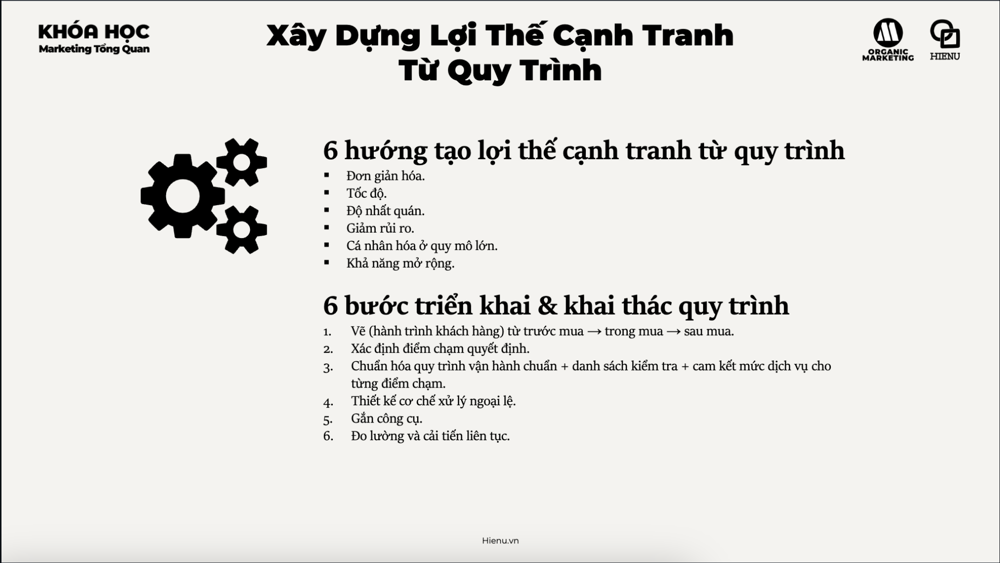
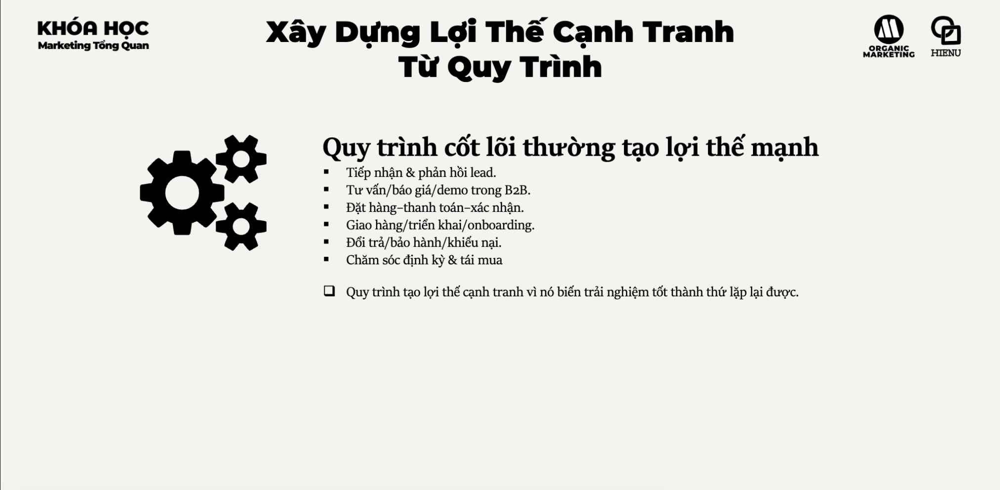

# Lợi thế cạnh tranh từ process

# LỢI THẾ CẠNH TRANH TỪ QUY TRÌNH (PROCESS ADVANTAGE)

## TỪ CÁCH LÀM VIỆC ĐẾN HỆ THỐNG TẠO RA TRẢI NGHIỆM, HIỆU SUẤT VÀ TĂNG TRƯỞNG

---

# 1. BẢN CHẤT VẤN ĐỀ LÀ GÌ?

Nhiều doanh nghiệp nghĩ:

> Quy trình là tài liệu nội bộ.

> Quy trình là SOP.

> Quy trình là thứ dành cho vận hành.

---

Đó là góc nhìn cấp thấp.

---

Ở cấp độ chiến lược:

> Quy trình là cách doanh nghiệp chuyển đổi nguồn lực thành trải nghiệm khách hàng một cách nhất quán và có thể mở rộng.

---

Khách hàng không nhìn thấy:

* sơ đồ quy trình
* SOP
* workflow

---

Nhưng họ cảm nhận được:

* dễ mua hay khó mua
* nhanh hay chậm
* chuyên nghiệp hay lộn xộn
* đáng tin hay rủi ro

---

Cuối cùng:

Khách hàng không mua sản phẩm.

Khách hàng trải nghiệm quy trình.

---

# 2. TẠI SAO ĐIỀU NÀY QUAN TRỌNG?

Mọi doanh nghiệp đều có:

* sản phẩm
* giá
* marketing
* nhân sự

---

Nhưng rất ít doanh nghiệp có:

* quy trình tốt
* quy trình nhất quán
* quy trình có thể mở rộng

---

Quy trình ảnh hưởng trực tiếp tới:

### Trước mua

* tốc độ phản hồi
* chất lượng tư vấn
* tỷ lệ chuyển đổi

---

### Trong mua

* thanh toán
* giao hàng
* triển khai

---

### Sau mua

* bảo hành
* hỗ trợ
* tái mua

---

Do đó:

Process tác động tới:

* Conversion
* CAC
* Retention
* NPS
* LTV

---

# 3. DOANH NGHIỆP LỚN NHÌN QUY TRÌNH NHƯ THẾ NÀO?

Doanh nghiệp nhỏ:

Giỏi nhờ cá nhân.

---

Doanh nghiệp lớn:

Giỏi nhờ hệ thống.

---

Doanh nghiệp nhỏ hỏi:

> Ai làm việc này?

---

Doanh nghiệp lớn hỏi:

> Quy trình nào tạo ra kết quả này?

---

Mục tiêu:

Không phụ thuộc người giỏi.

Mà phụ thuộc hệ thống tốt.

---

# 4. 6 HƯỚNG TẠO LỢI THẾ CẠNH TRANH TỪ QUY TRÌNH

---

# HƯỚNG 1

ĐƠN GIẢN HÓA

## Bản chất

Khách hàng ghét sự phức tạp.

---

Ví dụ

Mở tài khoản:

20 bước

↓

Tỷ lệ bỏ cuộc cao

---

3 bước

↓

Tỷ lệ hoàn thành cao

---

Nguyên tắc:

> Mỗi bước thừa là một điểm mất khách hàng.

---

Lợi thế:

* tăng conversion
* giảm chi phí vận hành
* giảm sai sót

---

# HƯỚNG 2

TỐC ĐỘ

## Bản chất

Nhu cầu có thời điểm.

---

Lead để 5 phút.

Khác hoàn toàn lead để 24 giờ.

---

Tốc độ ảnh hưởng:

* conversion
* sự hài lòng
* niềm tin

---

Nguyên tắc:

> Nhanh thường thắng hoàn hảo.

---

# HƯỚNG 3

ĐỘ NHẤT QUÁN

## Bản chất

Khách hàng muốn trải nghiệm giống nhau.

---

Không muốn:

Nhân viên A phục vụ tốt.

Nhân viên B phục vụ tệ.

---

Lợi thế:

Tạo niềm tin ở quy mô lớn.

---

# HƯỚNG 4

GIẢM RỦI RO

## Bản chất

Khách hàng luôn lo:

* giao sai
* mất tiền
* lỗi sản phẩm
* bảo hành khó

---

Quy trình tốt giúp:

Loại bỏ rủi ro cảm nhận.

---

Ví dụ

Amazon

Một phần thành công đến từ:

* đổi trả dễ
* hoàn tiền dễ

---

# HƯỚNG 5

CÁ NHÂN HÓA Ở QUY MÔ LỚN

## Bản chất

Khách hàng muốn được đối xử như cá nhân.

---

Doanh nghiệp muốn phục vụ hàng triệu người.

---

Quy trình kết hợp:

* CRM
* Automation
* Data

để tạo trải nghiệm cá nhân hóa.

---

Lợi thế:

Tăng retention.

Tăng loyalty.

---

# HƯỚNG 6

KHẢ NĂNG MỞ RỘNG

## Bản chất

Điều gì hoạt động với:

100 khách hàng

chưa chắc hoạt động với:

100.000 khách hàng.

---

Quy trình tốt giúp:

* nhân bản
* mở rộng
* giảm phụ thuộc con người

---

# 5. QUY TRÌNH CỐT LÕI THƯỜNG TẠO LỢI THẾ CẠNH TRANH

---

# TIẾP NHẬN VÀ PHẢN HỒI LEAD

Mục tiêu:

Biến nhu cầu thành cơ hội.

---

KPI:

* Lead Response Time
* Contact Rate

---

# TƯ VẤN - BÁO GIÁ - DEMO

Đặc biệt quan trọng với B2B.

---

KPI:

* Demo Rate
* Proposal Acceptance Rate

---

# ĐẶT HÀNG - THANH TOÁN - XÁC NHẬN

Mục tiêu:

Giảm bỏ giỏ hàng.

---

KPI:

* Checkout Completion
* Payment Success Rate

---

# GIAO HÀNG - TRIỂN KHAI - ONBOARDING

Mục tiêu:

Biến khách mua thành khách sử dụng.

---

KPI:

* Time To Value
* Activation Rate

---

# ĐỔI TRẢ - BẢO HÀNH - KHIẾU NẠI

Mục tiêu:

Biến sự cố thành cơ hội tạo niềm tin.

---

KPI:

* Resolution Time
* CSAT

---

# CHĂM SÓC - TÁI MUA

Mục tiêu:

Tăng LTV.

---

KPI:

* Repeat Purchase Rate
* Retention Rate

---

# 6. 6 BƯỚC TRIỂN KHAI VÀ KHAI THÁC QUY TRÌNH

---

# BƯỚC 1

VẼ HÀNH TRÌNH KHÁCH HÀNG

Customer Journey Mapping.

---

Từ:

Nhận biết

↓

Mua

↓

Sử dụng

↓

Giới thiệu

---

# BƯỚC 2

XÁC ĐỊNH ĐIỂM CHẠM TUYẾN TÍNH

Mỗi bước:

Ai làm?

Khi nào?

Kết quả là gì?

---

# BƯỚC 3

CHUẨN HÓA

Bao gồm:

* SOP
* Checklist
* SLA

---

Ví dụ

Lead mới

↓

Phản hồi trong 15 phút

---

Đây chính là SLA.

---

# BƯỚC 4

THIẾT KẾ XỬ LÝ NGOẠI LỆ

Không phải mọi khách hàng đều giống nhau.

---

Quy trình phải trả lời:

Nếu lỗi xảy ra thì sao?

---

# BƯỚC 5

GẮN CÔNG CỤ ĐO

Ví dụ:

* CRM
* ERP
* Helpdesk
* Analytics

---

Không đo.

Không quản lý được.

---

# BƯỚC 6

ĐO LƯỜNG VÀ CẢI TIẾN

Chu kỳ:

Đo

↓

Phân tích

↓

Sửa

↓

Chuẩn hóa

↓

Lặp lại

---

# 7. CÁC LUẬN ĐIỂM THỰC CHIẾN

## Luận điểm 1

Khách hàng đánh giá doanh nghiệp qua quy trình.

Không phải SOP.

---

## Luận điểm 2

Tăng tốc độ thường rẻ hơn tăng ngân sách marketing.

---

## Luận điểm 3

Mỗi bước ma sát đều làm mất khách hàng.

---

## Luận điểm 4

Doanh nghiệp mở rộng nhanh thường chết vì quy trình yếu.

---

## Luận điểm 5

Quy trình tốt giúp người bình thường tạo ra kết quả tốt.

---

## Luận điểm 6

Lợi thế cạnh tranh bền vững thường nằm trong hệ thống vận hành.

---

# 8. FRAMEWORK RA QUYẾT ĐỊNH

## PROCESS ADVANTAGE FRAMEWORK

### Journey

Khách đi qua hành trình nào?

↓

### Touchpoint

Có những điểm chạm nào?

↓

### Standard

Tiêu chuẩn là gì?

↓

### SLA

Cam kết phục vụ là gì?

↓

### Exception

Ngoại lệ xử lý ra sao?

↓

### Measurement

Đo bằng KPI nào?

↓

### Improvement

Chu kỳ cải tiến là gì?

---

# 9. MENTAL MODELS QUAN TRỌNG

## Friction Kills Conversion

Ma sát làm mất khách hàng.

---

## Systems Beat Heroes

Hệ thống thắng người hùng.

---

## Time To Value

Khách hàng càng nhận giá trị nhanh càng dễ ở lại.

---

## Service Recovery Paradox

Xử lý sự cố tốt có thể tạo lòng trung thành mạnh hơn việc không có sự cố.

---

## Continuous Improvement

Lợi thế đến từ cải tiến liên tục.

---

## Scalability First

Quy trình phải được thiết kế cho tăng trưởng.

---

# 10. CHECKLIST ĐÁNH GIÁ

## HÀNH TRÌNH KHÁCH HÀNG

* Đã vẽ Customer Journey chưa?
* Có điểm chạm nào bị bỏ sót không?

---

## TỐC ĐỘ

* Lead phản hồi bao lâu?
* Khiếu nại xử lý bao lâu?

---

## NHẤT QUÁN

* Mọi nhân viên làm giống nhau không?
* Có SOP không?

---

## SLA

* Có cam kết rõ cho từng điểm chạm?
* Có theo dõi SLA không?

---

## NGOẠI LỆ

* Có quy trình xử lý sự cố?
* Có cơ chế escalation?

---

## DỮ LIỆU

* Có CRM?
* Có dashboard?
* Có KPI theo dõi?

---

## MỞ RỘNG

* Quy trình có chịu được gấp 10 lần khách hàng không?
* Có phụ thuộc cá nhân nào không?

---

# KẾT LUẬN

Doanh nghiệp yếu cạnh tranh bằng nỗ lực.

Doanh nghiệp khá cạnh tranh bằng con người.

Doanh nghiệp mạnh cạnh tranh bằng quy trình.

Lợi thế cạnh tranh từ Process không nằm ở việc có nhiều SOP hơn đối thủ.

Nó nằm ở khả năng tạo ra trải nghiệm:

* đơn giản hơn,
* nhanh hơn,
* nhất quán hơn,
* ít rủi ro hơn,
* cá nhân hóa hơn,
* và dễ mở rộng hơn.

Cuối cùng, khách hàng có thể không nhìn thấy quy trình.

Nhưng họ luôn cảm nhận được kết quả của quy trình.

Và trong dài hạn, chính quy trình là thứ biến một doanh nghiệp tốt thành một doanh nghiệp có thể tăng trưởng lớn và bền vững.
