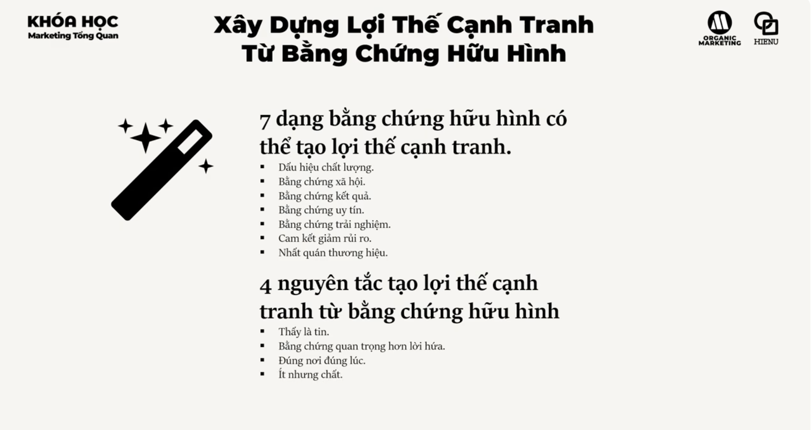
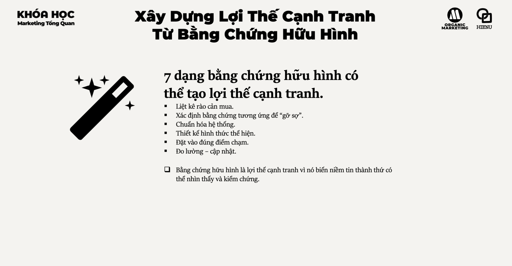

# Lợi thế cạnh tranh từ physical evidence




# LỢI THẾ CẠNH TRANH TỪ PHYSICAL EVIDENCE

## TỪ "HÌNH THỨC BÊN NGOÀI" ĐẾN "BẰNG CHỨNG HỮU HÌNH CỦA GIÁ TRỊ THƯƠNG HIỆU"

---

# 1. BẢN CHẤT VẤN ĐỀ LÀ GÌ?

Nhiều doanh nghiệp hiểu Physical Evidence là:

* văn phòng đẹp
* cửa hàng đẹp
* website đẹp
* bao bì đẹp

Đây chỉ là phần nổi.

---

Ở cấp độ chiến lược:

> Physical Evidence là toàn bộ bằng chứng hữu hình giúp khách hàng tin rằng lời hứa thương hiệu là thật.

---

Khách hàng không thể nhìn thấy:

* chất lượng dịch vụ tương lai
* năng lực vận hành
* mức độ chuyên nghiệp
* cam kết của doanh nghiệp

---

Vì vậy họ phải đánh giá qua các tín hiệu hữu hình.

---

Ví dụ:

Khách hàng chưa biết đồ ăn ngon hay không.

Nhưng họ nhìn:

* mặt tiền
* không gian
* đồng phục
* menu
* vệ sinh

để suy đoán chất lượng.

---

Physical Evidence thực chất là:

> Hệ thống tín hiệu giúp giảm bất cân xứng thông tin giữa doanh nghiệp và khách hàng.

---

# 2. TẠI SAO ĐIỀU NÀY QUAN TRỌNG?

## Khách hàng đánh giá trước khi trải nghiệm

Trước khi dùng sản phẩm.

Khách hàng đã hình thành kỳ vọng.

---

Ví dụ:

Hai spa có chất lượng tương đương.

Spa A:

* cũ kỹ
* lộn xộn

Spa B:

* sạch sẽ
* chuyên nghiệp

---

Đa số khách hàng sẽ chọn Spa B.

---

## Giảm rủi ro cảm nhận

Khách hàng luôn sợ:

* mất tiền
* mua nhầm
* chất lượng kém

---

Physical Evidence giúp trả lời:

> "Doanh nghiệp này có đáng tin không?"

---

## Tăng khả năng định giá cao

Khách hàng không mua giá trị thực tế.

Khách hàng mua giá trị cảm nhận.

---

Ví dụ:

Một ly cà phê.

Chi phí nguyên liệu tương tự.

Nhưng:

* không gian
* trải nghiệm
* thiết kế

cho phép bán giá cao gấp nhiều lần.

---

## Tăng Conversion

Nhiều doanh nghiệp đổ tiền vào quảng cáo.

Nhưng mất khách vì:

* website xấu
* cửa hàng lộn xộn
* quy trình thiếu chuyên nghiệp

---

# 3. DOANH NGHIỆP LỚN NHÌN VẤN ĐỀ NÀY NHƯ THẾ NÀO?

Doanh nghiệp nhỏ nghĩ:

> Physical Evidence là chi phí.

---

Doanh nghiệp lớn nghĩ:

> Physical Evidence là công cụ xây niềm tin.

---

Họ thiết kế mọi thứ có chủ đích:

* showroom
* website
* app
* bao bì
* đồng phục
* tài liệu bán hàng
* email
* hóa đơn
* điểm bán

---

Mục tiêu:

Tạo cảm giác:

* chuyên nghiệp
* đáng tin
* nhất quán

---

Khách hàng phải cảm nhận cùng một thương hiệu ở mọi nơi.

---

# 4. NHỮNG YẾU TỐ QUYẾT ĐỊNH THÀNH CÔNG HAY THẤT BẠI

## Sự nhất quán

Logo cao cấp.

Website cẩu thả.

---

Thông điệp bị phá vỡ.

---

## Phù hợp định vị

Không phải cứ sang trọng là tốt.

---

Ví dụ:

Thương hiệu bình dân.

Nhưng đầu tư hình ảnh quá cao cấp.

---

Có thể làm khách hàng nghĩ:

"Chắc đắt."

---

## Đồng bộ toàn hành trình

Nhiều doanh nghiệp đẹp ở quảng cáo.

Nhưng tệ ở điểm bán.

---

Khách hàng đánh giá tổng thể.

Không đánh giá từng phần.

---

## Chứng minh được lời hứa

Nếu thương hiệu nói:

"Nhanh nhất"

---

Khách hàng phải thấy:

* quy trình nhanh
* phản hồi nhanh
* giao hàng nhanh

---

# 5. 6 HƯỚNG TẠO LỢI THẾ CẠNH TRANH TỪ PHYSICAL EVIDENCE

---

# HƯỚNG 1

KHÔNG GIAN VÀ MÔI TRƯỜNG TRẢI NGHIỆM

Ví dụ:

* cửa hàng
* showroom
* văn phòng
* quầy trưng bày

---

Mục tiêu:

Tạo niềm tin và cảm xúc.

---

# HƯỚNG 2

BAO BÌ VÀ TRÌNH BÀY SẢN PHẨM

Bao bì không chỉ để bảo vệ.

---

Bao bì giúp:

* tăng giá trị cảm nhận
* tạo khác biệt
* tăng khả năng nhận diện

---

# HƯỚNG 3

TÀI LIỆU VÀ ĐIỂM CHẠM THƯƠNG HIỆU

Ví dụ:

* catalogue
* proposal
* hợp đồng
* email

---

Khách hàng đánh giá năng lực qua những chi tiết này.

---

# HƯỚNG 4

GIAO DIỆN SỐ

Bao gồm:

* website
* app
* landing page

---

Trong nhiều ngành:

Website chính là cửa hàng.

---

# HƯỚNG 5

CHỨNG CỨ XÃ HỘI

Ví dụ:

* review
* testimonial
* case study
* chứng nhận
* giải thưởng

---

Đây là Physical Evidence cực mạnh.

---

# HƯỚNG 6

BIỂU TƯỢNG VÀ TÍN HIỆU THƯƠNG HIỆU

Ví dụ:

* logo
* màu sắc
* đồng phục
* xe giao hàng

---

Giúp tăng khả năng ghi nhớ.

---

# 6. NHỮNG LUẬN ĐIỂM THỰC CHIẾN

## Luận điểm 1

Khách hàng đánh giá những gì họ nhìn thấy.

Không phải những gì doanh nghiệp biết.

---

## Luận điểm 2

Physical Evidence tạo niềm tin trước khi trải nghiệm.

---

## Luận điểm 3

Tín hiệu mạnh giúp giảm chi phí bán hàng.

---

## Luận điểm 4

Thiết kế tốt giúp tăng khả năng định giá.

---

## Luận điểm 5

Nhất quán quan trọng hơn sang trọng.

---

## Luận điểm 6

Mọi điểm chạm đều đang gửi tín hiệu.

Dù doanh nghiệp có chủ ý hay không.

---

# 7. NHỮNG SAI LẦM PHỔ BIẾN

## Sai lầm 1

Chỉ đầu tư logo.

Không đầu tư trải nghiệm.

---

## Sai lầm 2

Website đẹp nhưng khó dùng.

---

## Sai lầm 3

Định vị cao cấp nhưng điểm bán bình dân.

---

## Sai lầm 4

Không có bằng chứng xã hội.

---

## Sai lầm 5

Không đồng bộ nhận diện.

---

## Sai lầm 6

Tập trung hình thức.

Bỏ qua chất lượng thực.

---

# 8. FRAMEWORK PHÂN TÍCH VÀ RA QUYẾT ĐỊNH

## PHYSICAL EVIDENCE ADVANTAGE FRAMEWORK

### Bước 1

Lời hứa thương hiệu là gì?

↓

### Bước 2

Khách hàng cần bằng chứng gì để tin?

↓

### Bước 3

Điểm chạm nào quan trọng nhất?

↓

### Bước 4

Thiết kế tín hiệu hữu hình phù hợp

↓

### Bước 5

Đảm bảo nhất quán

↓

### Bước 6

Đo ảnh hưởng tới hành vi mua

---

## Công thức

```text
Brand Promise

↓

Physical Signals

↓

Trust

↓

Conversion

↓

Loyalty
```

---

# 9. MENTAL MODELS QUAN TRỌNG

## Signaling Theory

Khách hàng đánh giá qua tín hiệu.

---

## Halo Effect

Ấn tượng ban đầu ảnh hưởng đánh giá tổng thể.

---

## First Impression Bias

Ấn tượng đầu tiên rất khó thay đổi.

---

## Risk Reduction

Khách hàng luôn tìm tín hiệu giảm rủi ro.

---

## Consistency Principle

Tín hiệu nhất quán tạo niềm tin.

---

## Perceived Value

Giá trị cảm nhận thường quan trọng hơn giá trị thực.

---

# 10. CHECKLIST ĐÁNH GIÁ

## NHẬN DIỆN

* Có đồng bộ logo, màu sắc, hình ảnh không?
* Có dễ nhận biết không?

---

## ĐIỂM BÁN

* Có chuyên nghiệp không?
* Có phù hợp định vị không?

---

## BAO BÌ

* Có tạo giá trị cảm nhận không?
* Có khác biệt với đối thủ không?

---

## WEBSITE / APP

* Có đáng tin không?
* Có dễ sử dụng không?

---

## CHỨNG CỨ XÃ HỘI

* Có review không?
* Có case study không?
* Có khách hàng tiêu biểu không?

---

## NHẤT QUÁN

* Các điểm chạm có cùng một trải nghiệm không?

---

## HIỆU QUẢ KINH DOANH

* Conversion có tăng không?
* NPS có tăng không?
* Tỷ lệ quay lại có tăng không?
* Có tăng khả năng bán giá cao hơn không?

---

# KẾT LUẬN

Doanh nghiệp yếu xem Physical Evidence là trang trí.

Doanh nghiệp khá xem Physical Evidence là nhận diện thương hiệu.

Doanh nghiệp mạnh xem Physical Evidence là hệ thống bằng chứng giúp khách hàng tin tưởng.

Lợi thế cạnh tranh từ Physical Evidence không nằm ở việc đẹp hơn đối thủ.

Nó nằm ở khả năng biến những giá trị vô hình như:

* chất lượng,
* uy tín,
* chuyên môn,
* sự chuyên nghiệp,

thành những tín hiệu hữu hình mà khách hàng có thể nhìn thấy, cảm nhận và tin tưởng ngay trước khi mua.

Cuối cùng, khách hàng không thể nhìn thấy năng lực thực sự của doanh nghiệp.

Họ chỉ nhìn thấy các bằng chứng mà doanh nghiệp để lại.

Và rất nhiều quyết định mua được đưa ra từ những bằng chứng đó trước khi sản phẩm được sử dụng.
