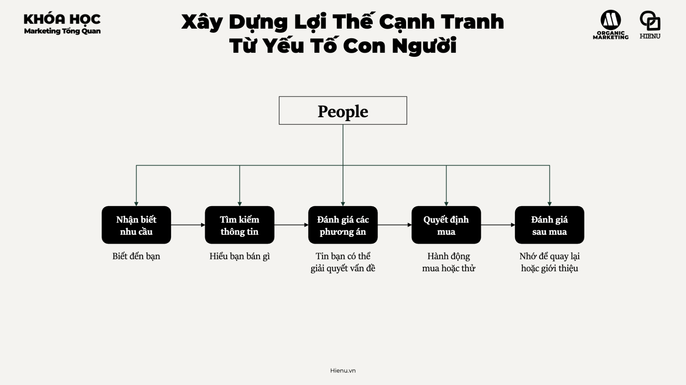
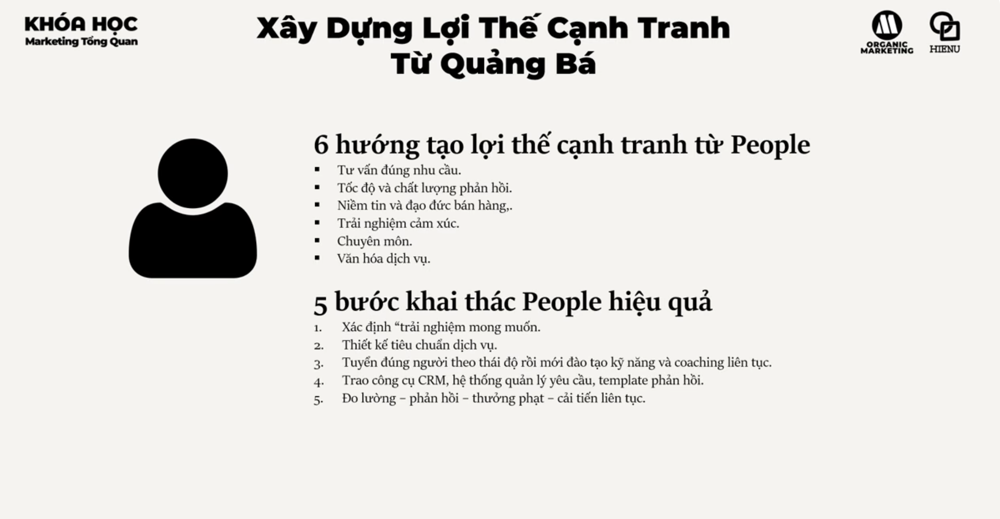

# Lợi thế cạnh tranh từ con người

# LỢI THẾ CẠNH TRANH TỪ PEOPLE

## TỪ NHÂN VIÊN BÁN HÀNG ĐẾN HỆ THỐNG TẠO NIỀM TIN VÀ TRẢI NGHIỆM

---

# 1. BẢN CHẤT VẤN ĐỀ LÀ GÌ?

Trong Marketing Mix 7P, nhiều doanh nghiệp xem People đơn giản là:

* nhân viên bán hàng
* nhân viên chăm sóc khách hàng
* nhân viên hỗ trợ

Đây là góc nhìn vận hành.

---

Ở cấp độ chiến lược:

> People là hệ thống tạo niềm tin, chuyển đổi nhận thức thành hành động và biến khách hàng thành mối quan hệ dài hạn.

---

Khách hàng không chỉ đánh giá:

* sản phẩm
* giá
* thương hiệu

Họ còn đánh giá:

* người tư vấn
* người hỗ trợ
* người chăm sóc
* người giải quyết vấn đề

---

Trong nhiều ngành dịch vụ:

Người bán chính là sản phẩm.

---

Ví dụ:

* tư vấn tài chính
* bất động sản
* bảo hiểm
* giáo dục
* y tế
* B2B

---

Khách hàng thường mua vì tin người trước khi tin công ty.

---

# 2. TẠI SAO ĐIỀU NÀY QUAN TRỌNG?

People ảnh hưởng tới toàn bộ hành trình mua.

---

## Giai đoạn 1

NHẬN BIẾT NHU CẦU

Khách hàng biết đến doanh nghiệp qua:

* nhân viên
* cộng đồng
* người giới thiệu
* sales

---

## Giai đoạn 2

TÌM KIẾM THÔNG TIN

Khách hàng muốn hiểu:

* bạn bán gì
* có phù hợp không
* có đáng tin không

---

## Giai đoạn 3

ĐÁNH GIÁ PHƯƠNG ÁN

Đây là nơi People tạo khác biệt lớn nhất.

---

Khách hàng hỏi:

* có nên mua không?
* có rủi ro không?
* ai đã dùng rồi?

---

## Giai đoạn 4

QUYẾT ĐỊNH MUA

Một cuộc gọi tốt.

Một buổi demo tốt.

Một nhân viên giỏi.

Có thể tạo ra doanh thu rất lớn.

---

## Giai đoạn 5

ĐÁNH GIÁ SAU MUA

Khách hàng quay lại hay rời đi thường phụ thuộc vào trải nghiệm với con người.

---

# 3. DOANH NGHIỆP LỚN NHÌN PEOPLE NHƯ THẾ NÀO?

Doanh nghiệp nhỏ nghĩ:

> Tuyển người để làm việc.

---

Doanh nghiệp lớn nghĩ:

> Xây hệ thống tạo trải nghiệm nhất quán thông qua con người.

---

Họ không phụ thuộc vào ngôi sao bán hàng.

Họ xây:

* quy trình
* đào tạo
* coaching
* CRM
* tiêu chuẩn dịch vụ

---

Mục tiêu:

Khách hàng nhận được trải nghiệm tốt dù gặp bất kỳ nhân viên nào.

---

# 4. 6 HƯỚNG TẠO LỢI THẾ CẠNH TRANH TỪ PEOPLE

---

# HƯỚNG 1

TƯ VẤN ĐÚNG NHU CẦU

## Bản chất

Khách hàng không muốn được bán.

Khách hàng muốn được giúp.

---

Người bán yếu:

Giới thiệu sản phẩm.

---

Người bán giỏi:

Tìm hiểu vấn đề.

---

Người bán xuất sắc:

Giúp khách hàng ra quyết định đúng.

---

Lợi thế cạnh tranh:

Khách hàng cảm thấy được thấu hiểu.

---

# HƯỚNG 2

TỐC ĐỘ VÀ CHẤT LƯỢNG PHẢN HỒI

## Bản chất

Nhu cầu có thời điểm.

Niềm tin cũng có thời điểm.

---

Nếu phản hồi quá chậm:

Đối thủ sẽ xuất hiện.

---

Trong nhiều ngành:

Tốc độ phản hồi là lợi thế cạnh tranh.

---

Ví dụ

Khách để lại lead.

Phản hồi trong:

5 phút

và

24 giờ

cho tỷ lệ chuyển đổi hoàn toàn khác nhau.

---

# HƯỚNG 3

NIỀM TIN VÀ ĐẠO ĐỨC BÁN HÀNG

## Bản chất

Khách hàng sợ bị bán.

---

Nếu nhân viên:

* nói quá
* hứa quá
* giấu rủi ro

---

Có thể tạo doanh số ngắn hạn.

Nhưng phá hủy thương hiệu dài hạn.

---

Doanh nghiệp lớn xây:

Trust Before Transaction.

---

# HƯỚNG 4

TRẢI NGHIỆM CẢM XÚC

## Bản chất

Con người nhớ cảm xúc lâu hơn thông tin.

---

Khách hàng thường quên:

* tính năng
* thông số

---

Nhưng nhớ:

* được tôn trọng
* được quan tâm
* được hỗ trợ

---

Đây là lý do nhiều khách hàng trung thành với thương hiệu dù giá cao hơn.

---

# HƯỚNG 5

CHUYÊN MÔN

## Bản chất

Niềm tin đến từ năng lực.

---

Khách hàng muốn thấy:

* hiểu ngành
* hiểu sản phẩm
* hiểu vấn đề

---

Trong B2B:

Chuyên môn thường là yếu tố quyết định.

---

# HƯỚNG 6

VĂN HÓA DỊCH VỤ

## Bản chất

Một nhân viên tốt không tạo lợi thế cạnh tranh.

Một hệ thống văn hóa tốt mới tạo lợi thế cạnh tranh.

---

Ví dụ:

Một số thương hiệu nổi tiếng vì:

* phục vụ tốt
* chăm sóc tốt
* hỗ trợ nhanh

---

Điều đó đến từ văn hóa.

Không phải cá nhân.

---

# 5. 5 BƯỚC KHAI THÁC PEOPLE HIỆU QUẢ

---

# BƯỚC 1

XÁC ĐỊNH TRẢI NGHIỆM MONG MUỐN

Trả lời:

Khách hàng muốn cảm thấy thế nào?

---

Ví dụ:

* được tin tưởng
* được chăm sóc
* được tôn trọng
* được hỗ trợ

---

# BƯỚC 2

THIẾT KẾ TIÊU CHUẨN DỊCH VỤ

Không thể quản lý bằng cảm tính.

---

Phải chuẩn hóa:

* thời gian phản hồi
* quy trình tư vấn
* quy trình xử lý khiếu nại
* quy trình chăm sóc

---

# BƯỚC 3

TUYỂN ĐÚNG NGƯỜI

Nguyên tắc:

Attitude First

Skill Second

---

Kỹ năng có thể đào tạo.

Thái độ rất khó thay đổi.

---

Sau tuyển dụng:

* coaching
* training
* đánh giá liên tục

---

# BƯỚC 4

TRAO CÔNG CỤ

Con người tốt nhưng hệ thống yếu vẫn thất bại.

---

Cần:

* CRM
* Ticket System
* Knowledge Base
* Script
* Template phản hồi

---

Mục tiêu:

Tăng năng suất và tính nhất quán.

---

# BƯỚC 5

ĐO LƯỜNG VÀ CẢI TIẾN

Không đo.

Không cải thiện.

---

Đánh giá:

* hàng tuần
* hàng tháng
* hàng quý

---

Kết hợp:

* thưởng
* coaching
* đào tạo
* cải tiến quy trình

---

# 6. CÁC LUẬN ĐIỂM THỰC CHIẾN

## Luận điểm 1

Khách hàng mua niềm tin trước khi mua sản phẩm.

---

## Luận điểm 2

Người bán giỏi làm tăng Conversion.

Người hỗ trợ giỏi làm tăng Retention.

---

## Luận điểm 3

Một trải nghiệm tệ có thể phá hủy hàng triệu đồng ngân sách marketing.

---

## Luận điểm 4

People là cầu nối giữa lời hứa thương hiệu và trải nghiệm thực tế.

---

## Luận điểm 5

Văn hóa dịch vụ tốt khó sao chép hơn sản phẩm.

---

# 7. NHỮNG SAI LẦM PHỔ BIẾN

* Chỉ tuyển theo kỹ năng.
* Không có tiêu chuẩn dịch vụ.
* Không đào tạo liên tục.
* Không coaching.
* Không đo lường trải nghiệm.
* Chỉ thưởng theo doanh số.
* Ép bán bằng mọi giá.
* Không có CRM.
* Không quản lý chất lượng phản hồi.

---

# 8. FRAMEWORK RA QUYẾT ĐỊNH

## PEOPLE ADVANTAGE FRAMEWORK

### Experience

Muốn khách hàng cảm thấy gì?

↓

### Standards

Tiêu chuẩn dịch vụ là gì?

↓

### Hiring

Tuyển người như thế nào?

↓

### Training

Đào tạo gì?

↓

### Tools

Cần công cụ nào?

↓

### Measurement

Đo bằng KPI gì?

↓

### Coaching

Cải thiện như thế nào?

↓

### Culture

Làm sao duy trì lâu dài?

---

# 9. MENTAL MODELS QUAN TRỌNG

## Trust Before Transaction

Niềm tin trước giao dịch.

---

## Service Profit Chain

Nhân viên tốt

↓

Khách hàng hài lòng

↓

Khách hàng trung thành

↓

Lợi nhuận tăng

---

## Moment Of Truth

Mỗi điểm chạm đều là khoảnh khắc quyết định.

---

## Emotional Memory

Khách hàng nhớ cảm xúc hơn dữ liệu.

---

## Systems Beat Heroes

Hệ thống thắng cá nhân xuất sắc.

---

## Culture Eats Process

Văn hóa mạnh giúp quy trình vận hành hiệu quả hơn.

---

# 10. CHECKLIST ĐÁNH GIÁ

## TRẢI NGHIỆM

* Đã xác định trải nghiệm mong muốn chưa?
* Khách hàng muốn cảm thấy gì?

---

## TUYỂN DỤNG

* Tuyển theo thái độ hay chỉ theo kỹ năng?
* Tỷ lệ nghỉ việc bao nhiêu?

---

## ĐÀO TẠO

* Có chương trình đào tạo chuẩn?
* Có coaching định kỳ?

---

## CÔNG CỤ

* Có CRM?
* Có hệ thống quản lý yêu cầu?
* Có template phản hồi?

---

## HIỆU SUẤT

* Tỷ lệ chuyển đổi?
* Thời gian phản hồi?
* Tỷ lệ xử lý thành công?

---

## TRẢI NGHIỆM KHÁCH HÀNG

* NPS?
* CSAT?
* Tỷ lệ khiếu nại?
* Tỷ lệ khách quay lại?

---

## VĂN HÓA

* Nhân viên có hiểu giá trị thương hiệu không?
* Hành vi phục vụ có nhất quán không?

---

# KẾT LUẬN

Doanh nghiệp yếu xem People là chi phí nhân sự.

Doanh nghiệp khá xem People là nguồn lực bán hàng.

Doanh nghiệp mạnh xem People là hệ thống tạo niềm tin và trải nghiệm.

Lợi thế cạnh tranh từ People không nằm ở việc có vài nhân viên xuất sắc.

Nó nằm ở khả năng biến toàn bộ đội ngũ thành một cỗ máy tạo ra trải nghiệm nhất quán, đáng tin cậy và khó sao chép.

Cuối cùng, khách hàng có thể quên quảng cáo, quên chương trình khuyến mãi, quên tính năng sản phẩm.

Nhưng họ hiếm khi quên cách mà doanh nghiệp khiến họ cảm thấy.
