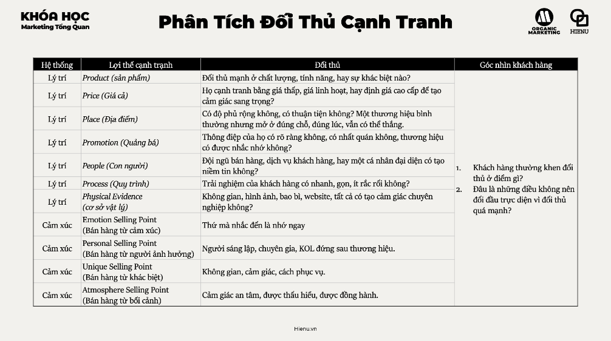
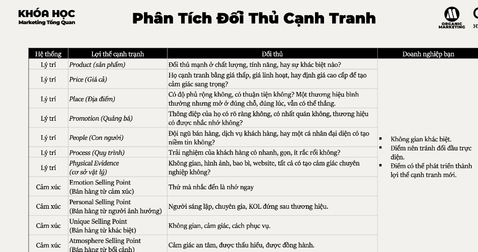
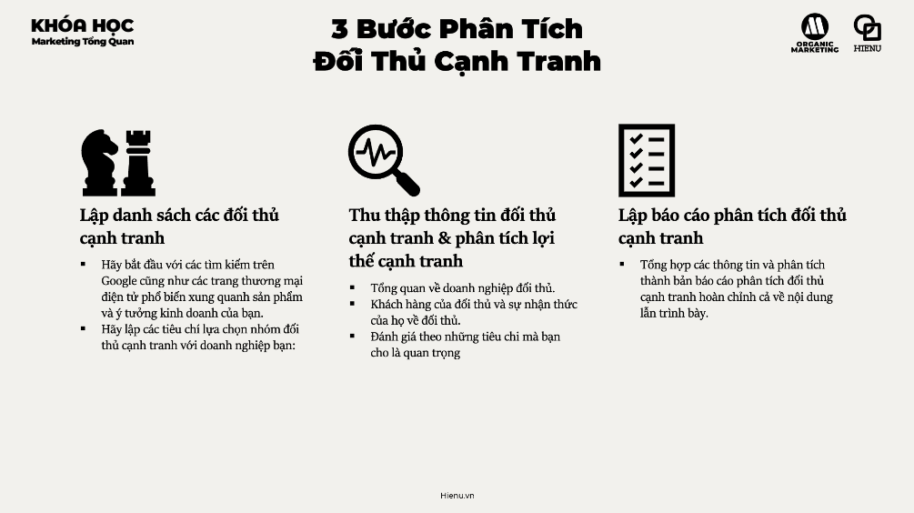
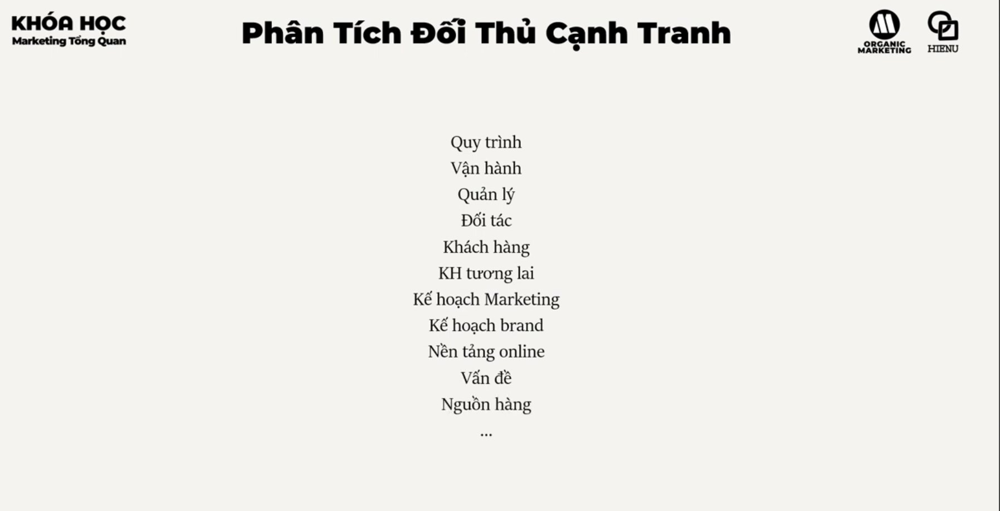

# Phân tích đối thủ


# Doanh nghiep cua ban


# 3 buoc phan tich doi thu




# PHÂN TÍCH ĐỐI THỦ CẠNH TRANH

## TỪ VIỆC THEO DÕI ĐỐI THỦ ĐẾN VIỆC TÌM RA LỢI THẾ CẠNH TRANH CỦA CHÍNH MÌNH

---

# 1. BẢN CHẤT VẤN ĐỀ LÀ GÌ?

Nhiều doanh nghiệp hiểu sai về phân tích đối thủ.

Họ nghĩ rằng:

* xem đối thủ bán gì
* xem đối thủ chạy quảng cáo gì
* xem đối thủ đang làm gì

là đủ.

---

Đó chỉ là hoạt động thu thập thông tin.

---

Ở cấp độ chiến lược:

> Phân tích đối thủ là quá trình tìm hiểu cách đối thủ tạo ra giá trị, tạo lợi thế cạnh tranh và chiếm lĩnh khách hàng để từ đó xác định vị thế cạnh tranh của chính doanh nghiệp.

---

Mục tiêu cuối cùng không phải:

"Hiểu đối thủ"

Mà là:

> "Hiểu cách chiến thắng trên thị trường."

---

Sai lầm phổ biến nhất:

Doanh nghiệp dành quá nhiều thời gian nhìn đối thủ.

Nhưng không hiểu khách hàng.

---

Khách hàng mới là chiến trường.

Đối thủ chỉ là người đang chiến đấu trên chiến trường đó.

---

# 2. TẠI SAO ĐIỀU NÀY QUAN TRỌNG?

## Tránh cạnh tranh sai chiến trường

Nhiều doanh nghiệp chết vì:

* đánh vào phân khúc sai
* cạnh tranh giá sai
* chọn sai kênh

---

Trong khi đối thủ thắng vì:

* chọn chiến trường dễ hơn
* chọn phân khúc lợi nhuận cao hơn

---

## Tìm khoảng trống thị trường

Phân tích đối thủ giúp trả lời:

* họ đang mạnh ở đâu?
* họ đang yếu ở đâu?
* họ bỏ quên khách hàng nào?

---

Đây chính là cơ hội.

---

## Dự đoán xu hướng cạnh tranh

Đối thủ thường để lại tín hiệu:

* tuyển dụng
* mở rộng sản phẩm
* mở rộng thị trường
* thay đổi giá

---

Những tín hiệu này cho thấy:

họ sắp làm gì.

---

## Bảo vệ thị phần

Nếu không theo dõi đối thủ.

Doanh nghiệp thường phát hiện quá muộn.

---

# 3. DOANH NGHIỆP LỚN NHÌN VẤN ĐỀ NÀY NHƯ THẾ NÀO?

Doanh nghiệp nhỏ:

Theo dõi đối thủ theo cảm tính.

---

Doanh nghiệp lớn:

Xây hệ thống Competitive Intelligence.

---

Họ theo dõi liên tục:

* sản phẩm
* giá
* truyền thông
* phân phối
* tuyển dụng
* tài chính
* công nghệ

---

Họ không hỏi:

> Đối thủ đang làm gì?

---

Họ hỏi:

> Đối thủ đang cố xây lợi thế cạnh tranh gì?

---

Ví dụ:

Đối thủ tuyển 50 nhân sự logistics.

---

Thông tin thực sự không phải:

"Tuyển người."

---

Mà là:

"Họ đang chuẩn bị mở rộng mạng lưới phân phối."

---

# 4. NHỮNG YẾU TỐ QUYẾT ĐỊNH THÀNH CÔNG HAY THẤT BẠI

## Phân loại đúng đối thủ

Đây là bước quan trọng nhất.

---

### Đối thủ trực tiếp

Cùng sản phẩm.

Cùng khách hàng.

---

### Đối thủ gián tiếp

Giải quyết cùng nhu cầu.

Khác cách tiếp cận.

---

### Đối thủ thay thế

Khách hàng dùng giải pháp khác hoàn toàn.

---

Ví dụ:

Taxi.

---

Đối thủ không chỉ là taxi khác.

Mà còn:

* xe cá nhân
* xe máy
* tàu điện
* xe buýt

---

## Tập trung vào năng lực thay vì chiến thuật

Sai lầm phổ biến:

Xem quảng cáo.

---

Đúng hơn là:

Hiểu hệ thống phía sau quảng cáo.

---

# 5. CÁC LUẬN ĐIỂM THỰC CHIẾN

## Luận điểm 1

Đối thủ không phải doanh nghiệp giống bạn.

Đối thủ là bất cứ thứ gì khách hàng có thể chọn thay bạn.

---

## Luận điểm 2

Thị trường thường thưởng cho sự khác biệt.

Không thưởng cho sự bắt chước.

---

## Luận điểm 3

Nếu mọi quyết định đều dựa trên đối thủ.

Bạn đang để đối thủ điều khiển chiến lược của mình.

---

## Luận điểm 4

Điểm yếu của đối thủ thường là cơ hội của bạn.

---

## Luận điểm 5

Không có đối thủ nào mạnh ở mọi mặt.

---

## Luận điểm 6

Mục tiêu của phân tích đối thủ là tìm vị trí chiến thắng.

Không phải tìm lỗi của đối thủ.

---

# 6. QUY TRÌNH PHÂN TÍCH ĐỐI THỦ CẠNH TRANH

---

# BƯỚC 1

LẬP DANH SÁCH ĐỐI THỦ

## Nhóm A

Đối thủ trực tiếp

---

## Nhóm B

Đối thủ gián tiếp

---

## Nhóm C

Đối thủ thay thế

---

Ví dụ:

Khóa học tiếng Anh.

---

Nhóm A:

Các trung tâm tiếng Anh khác.

---

Nhóm B:

Ứng dụng học tiếng Anh.

---

Nhóm C:

AI, Youtube, tự học.

---

# BƯỚC 2

THU THẬP THÔNG TIN

## Hồ sơ doanh nghiệp

* quy mô
* doanh thu ước tính
* số nhân sự

---

## Sản phẩm

* danh mục
* tính năng
* USP

---

## Giá

* mức giá
* cấu trúc giá

---

## Kênh phân phối

* online
* offline
* đại lý

---

## Promotion

* quảng cáo
* social
* PR

---

## Review khách hàng

Nguồn dữ liệu giá trị nhất.

---

## Tuyển dụng

Thường tiết lộ chiến lược tương lai.

---

# BƯỚC 3

XÁC ĐỊNH LỢI THẾ CẠNH TRANH

Đối thủ mạnh vì điều gì?

---

Ví dụ:

### Giá

* rẻ hơn

---

### Sản phẩm

* tốt hơn

---

### Kênh

* phủ rộng hơn

---

### Thương hiệu

* uy tín hơn

---

### Hệ sinh thái

* khó thay thế hơn

---

### Dữ liệu

* hiểu khách hàng hơn

---

# BƯỚC 4

LẬP BÁO CÁO PHÂN TÍCH

---

## TÓM TẮT THỊ TRƯỜNG

Ai đang dẫn đầu?

---

## TOP ĐỐI THỦ

Mỗi đối thủ:

* điểm mạnh
* điểm yếu
* cơ hội khai thác

---

## MA TRẬN SO SÁNH

| Tiêu chí    | Công ty A | Công ty B | Chúng ta |
| ----------- | --------- | --------- | -------- |
| Giá         | 9         | 6         | 7        |
| Chất lượng  | 8         | 9         | 7        |
| Phân phối   | 9         | 5         | 6        |
| Thương hiệu | 10        | 7         | 6        |

---

## KHOẢNG TRỐNG THỊ TRƯỜNG

Đâu là cơ hội?

---

## ĐỀ XUẤT CHIẾN LƯỢC

Nên:

* tấn công
* phòng thủ
* né tránh
* tạo thị trường mới

---

# 7. NHỮNG SAI LẦM PHỔ BIẾN

## Sai lầm 1

Chỉ nhìn đối thủ lớn nhất.

---

## Sai lầm 2

Không phân biệt đối thủ thay thế.

---

## Sai lầm 3

Chỉ phân tích sản phẩm.

---

## Sai lầm 4

Bắt chước chiến thuật.

---

## Sai lầm 5

Không cập nhật thường xuyên.

---

## Sai lầm 6

Biến phân tích đối thủ thành hoạt động nghiên cứu.

Không chuyển thành hành động.

---

# 8. FRAMEWORK PHÂN TÍCH VÀ RA QUYẾT ĐỊNH

## COMPETITIVE INTELLIGENCE FRAMEWORK

### Bước 1

Xác định đối thủ

↓

### Bước 2

Thu thập dữ liệu

↓

### Bước 3

Xác định lợi thế cạnh tranh

↓

### Bước 4

So sánh với doanh nghiệp

↓

### Bước 5

Tìm khoảng trống

↓

### Bước 6

Xác định vị thế chiến thắng

↓

### Bước 7

Ra quyết định chiến lược

---

## MA TRẬN PHÂN TÍCH

```text
Market

├── Competitor A
├── Competitor B
├── Competitor C

↓

Strengths

↓

Weaknesses

↓

Opportunities

↓

Strategic Position
```

---

## FRAMEWORK 7P PHÂN TÍCH ĐỐI THỦ

So sánh theo:

* Product
* Price
* Place
* Promotion
* People
* Process
* Physical Evidence

---

Đây là framework thực chiến nhất cho phần lớn doanh nghiệp.

---

# 9. MENTAL MODELS QUAN TRỌNG

## Competitive Advantage

Lợi thế cạnh tranh là thứ đối thủ khó sao chép.

---

## Zero-Sum Thinking

Không phải mọi cuộc cạnh tranh đều phải thắng-thua.

---

## Blue Ocean

Đôi khi chiến thắng là rời khỏi chiến trường hiện tại.

---

## Relative Advantage

Khách hàng so sánh tương đối.

Không đánh giá tuyệt đối.

---

## Weak Signal Detection

Những thay đổi nhỏ hôm nay có thể là xu hướng lớn ngày mai.

---

## Second Order Thinking

Không chỉ xem đối thủ làm gì.

Mà xem hậu quả của việc đó.

---

# 10. CHECKLIST ĐÁNH GIÁ

## DANH SÁCH ĐỐI THỦ

* Có đầy đủ trực tiếp?
* Có đầy đủ gián tiếp?
* Có đầy đủ thay thế?

---

## DỮ LIỆU

* Sản phẩm?
* Giá?
* Kênh?
* Promotion?
* Review?
* Tuyển dụng?

---

## LỢI THẾ CẠNH TRANH

* Họ mạnh nhất ở đâu?
* Vì sao mạnh?

---

## ĐIỂM YẾU

* Họ đang bỏ quên khách hàng nào?
* Họ đang yếu ở đâu?

---

## CHÚNG TA

* Đang mạnh gì?
* Đang yếu gì?

---

## CHIẾN LƯỢC

* Tấn công?
* Phòng thủ?
* Khác biệt hóa?
* Tạo thị trường mới?

---

## KẾT LUẬN

Doanh nghiệp yếu nghiên cứu đối thủ để sao chép.

Doanh nghiệp khá nghiên cứu đối thủ để tránh sai lầm.

Doanh nghiệp mạnh nghiên cứu đối thủ để tìm vị trí chiến thắng.

Phân tích đối thủ cạnh tranh không phải là hoạt động theo dõi người khác.

Nó là quá trình hiểu cấu trúc cạnh tranh của thị trường, nhận diện nguồn gốc lợi thế của từng người chơi và tìm ra khoảng trống mà doanh nghiệp có thể sở hữu.

Cuối cùng, mục tiêu không phải là biết đối thủ làm gì.

Mà là biết doanh nghiệp nên làm gì để chiến thắng.
