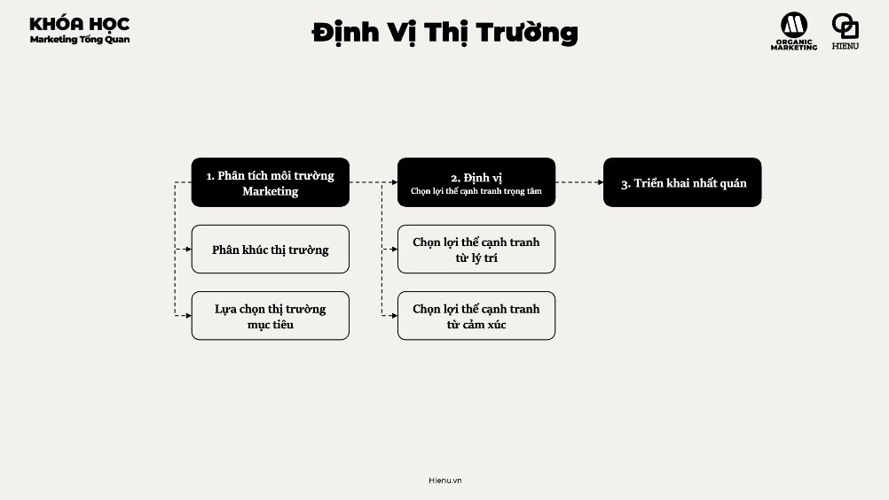

# Định vị thị trường


# ĐỊNH VỊ THỊ TRƯỜNG (MARKET POSITIONING)

## TỪ VIỆC BÁN SẢN PHẨM ĐẾN VIỆC SỞ HỮU MỘT VỊ TRÍ TRONG TÂM TRÍ KHÁCH HÀNG

---

# 1. BẢN CHẤT VẤN ĐỀ LÀ GÌ?

Nhiều doanh nghiệp nghĩ rằng định vị là:

* slogan
* thông điệp marketing
* bộ nhận diện thương hiệu
* câu tagline

Đó chỉ là phần thể hiện.

---

Ở cấp độ chiến lược:

> Định vị là quyết định doanh nghiệp muốn được khách hàng nhớ đến như thế nào và vì lý do gì.

---

Khách hàng không thể nhớ hàng chục thương hiệu trong một ngành.

Họ thường chỉ nhớ:

* thương hiệu rẻ nhất
* thương hiệu cao cấp nhất
* thương hiệu nhanh nhất
* thương hiệu an toàn nhất
* thương hiệu đáng tin nhất

---

Do đó:

Định vị thực chất là cuộc chiến giành một vị trí trong tâm trí khách hàng.

---

Điều quan trọng:

> Định vị không phải bạn nói mình là ai.

> Định vị là khách hàng nghĩ bạn là ai.

---

Ví dụ:

Hai quán cà phê bán sản phẩm tương tự.

Một quán được nhớ là:

"Cà phê làm việc."

Một quán được nhớ là:

"Cà phê check-in."

---

Đó là định vị.

---

# 2. TẠI SAO ĐIỀU NÀY QUAN TRỌNG?

## Giảm cạnh tranh trực diện

Nếu không có định vị.

Bạn trở thành:

"một lựa chọn nữa."

---

Khi đó:

Giá trở thành yếu tố cạnh tranh chính.

---

## Tăng khả năng được lựa chọn

Khách hàng không mua thương hiệu tốt nhất.

Khách hàng mua thương hiệu phù hợp nhất.

---

Định vị giúp khách hàng biết:

"Khi nào nên chọn bạn."

---

## Tăng hiệu quả marketing

Mọi hoạt động:

* quảng cáo
* bán hàng
* truyền thông

đều dễ dàng hơn khi định vị rõ.

---

## Tăng sức mạnh thương hiệu

Thương hiệu mạnh thường sở hữu:

một từ khóa

hoặc

một ý nghĩa

trong tâm trí khách hàng.

---

# 3. DOANH NGHIỆP LỚN NHÌN VẤN ĐỀ NÀY NHƯ THẾ NÀO?

Doanh nghiệp nhỏ thường hỏi:

> Chúng ta bán gì?

---

Doanh nghiệp lớn hỏi:

> Chúng ta muốn khách hàng nhớ điều gì?

---

Họ không bắt đầu từ sản phẩm.

Họ bắt đầu từ:

* khách hàng
* thị trường
* đối thủ
* khoảng trống nhận thức

---

Sau đó mới xây:

* sản phẩm
* thông điệp
* trải nghiệm

để củng cố định vị.

---

Doanh nghiệp lớn hiểu rằng:

> Định vị là quyết định chiến lược.

Không phải quyết định marketing.

---

# 4. NHỮNG YẾU TỐ QUYẾT ĐỊNH THÀNH CÔNG HAY THẤT BẠI

## Chọn đúng khách hàng mục tiêu

Không thể định vị cho tất cả mọi người.

---

Khách hàng khác nhau.

Nhu cầu khác nhau.

---

## Chọn đúng lợi thế cạnh tranh

Định vị phải dựa trên:

* năng lực thực
* lợi thế thực

---

Không phải mong muốn.

---

## Đủ khác biệt

Nếu giống đối thủ.

Khách hàng không nhớ.

---

## Đủ giá trị

Khác biệt nhưng khách hàng không quan tâm.

↓

Không có giá trị.

---

## Nhất quán

Định vị phải xuất hiện trong:

* sản phẩm
* giá
* truyền thông
* dịch vụ
* trải nghiệm

---

# 5. CÁC LUẬN ĐIỂM THỰC CHIẾN

## Luận điểm 1

Định vị không phải tìm cách bán cho mọi người.

Mà là tìm đúng người.

---

## Luận điểm 2

Khách hàng không mua sản phẩm.

Khách hàng mua ý nghĩa của sản phẩm.

---

## Luận điểm 3

Một định vị mạnh giúp giảm áp lực cạnh tranh giá.

---

## Luận điểm 4

Không ai chiến thắng bằng cách giống người dẫn đầu.

---

## Luận điểm 5

Định vị càng đơn giản càng mạnh.

---

## Luận điểm 6

Khách hàng nhớ một ý tưởng.

Không nhớ mười ý tưởng.

---

# 6. QUY TRÌNH XÂY DỰNG ĐỊNH VỊ THỊ TRƯỜNG

---

# BƯỚC 1

PHÂN TÍCH THỊ TRƯỜNG

## Khách hàng

* ai đang mua?
* ai chưa được phục vụ tốt?

---

## Đối thủ

* ai mạnh?
* ai yếu?
* ai đang chiếm vị trí nào?

---

## Xu hướng

* thị trường đang thay đổi gì?

---

# BƯỚC 2

PHÂN KHÚC THỊ TRƯỜNG (SEGMENTATION)

Có thể phân khúc theo:

---

## Nhân khẩu học

* tuổi
* giới tính
* thu nhập

---

## Địa lý

* thành phố
* khu vực

---

## Hành vi

* mức sử dụng
* tần suất mua

---

## Tâm lý

* giá trị sống
* lối sống
* động lực

---

# BƯỚC 3

LỰA CHỌN THỊ TRƯỜNG MỤC TIÊU (TARGETING)

Không phải mọi phân khúc đều đáng phục vụ.

---

Đánh giá:

### Quy mô

Lớn không?

---

### Tăng trưởng

Có tiềm năng không?

---

### Khả năng sinh lời

Lợi nhuận thế nào?

---

### Mức cạnh tranh

Có quá đông không?

---

### Năng lực doanh nghiệp

Có khả năng thắng không?

---

# BƯỚC 4

CHỌN LỢI THẾ CẠNH TRANH

Đây là phần cốt lõi.

---

## Định vị lý trí (Rational Positioning)

Khách hàng chọn vì:

* rẻ hơn
* nhanh hơn
* tốt hơn
* tiện hơn

---

Ví dụ:

* giao hàng nhanh
* giá thấp
* độ bền cao

---

## Định vị cảm xúc (Emotional Positioning)

Khách hàng chọn vì:

* tự hào
* an tâm
* thành công
* thuộc về

---

Ví dụ:

* đẳng cấp
* sáng tạo
* tự do

---

## Định vị bản sắc (Identity Positioning)

Khách hàng chọn vì:

"Tôi là kiểu người này."

---

Đây thường là định vị mạnh nhất.

---

# BƯỚC 5

XÂY DỰNG TUYÊN BỐ ĐỊNH VỊ

Công thức:

```text
Dành cho [khách hàng mục tiêu]

Thương hiệu của chúng tôi là [nhóm giải pháp]

Giúp [lợi ích chính]

Thông qua [lợi thế cạnh tranh]
```

---

Ví dụ:

```text
Dành cho doanh nghiệp SME

Chúng tôi là nền tảng quản lý bán hàng

Giúp tăng hiệu quả vận hành

Thông qua tự động hóa đơn giản và chi phí thấp.
```

---

# BƯỚC 6

TRIỂN KHAI NHẤT QUÁN

Định vị phải xuất hiện trong:

---

## Product

Sản phẩm phản ánh định vị.

---

## Price

Giá phản ánh định vị.

---

## Place

Kênh phản ánh định vị.

---

## Promotion

Thông điệp phản ánh định vị.

---

## People

Nhân viên phản ánh định vị.

---

## Process

Quy trình phản ánh định vị.

---

## Physical Evidence

Không gian phản ánh định vị.

---

# 7. NHỮNG SAI LẦM PHỔ BIẾN

## Sai lầm 1

Muốn phục vụ tất cả mọi người.

---

## Sai lầm 2

Không nghiên cứu đối thủ.

---

## Sai lầm 3

Định vị dựa trên mong muốn.

Không dựa trên năng lực.

---

## Sai lầm 4

Có quá nhiều thông điệp.

---

## Sai lầm 5

Định vị thay đổi liên tục.

---

## Sai lầm 6

Truyền thông một kiểu.

Trải nghiệm một kiểu.

---

# 8. FRAMEWORK PHÂN TÍCH VÀ RA QUYẾT ĐỊNH

## STP FRAMEWORK

Đây là framework nền tảng của mọi chiến lược định vị.

---

### S

SEGMENTATION

↓

Phân khúc thị trường

---

### T

TARGETING

↓

Chọn thị trường mục tiêu

---

### P

POSITIONING

↓

Chọn vị trí cạnh tranh

---

## POSITIONING FORMULA

```text
Market Segment

+

Customer Need

+

Competitive Advantage

+

Brand Promise

=

Positioning
```

---

## MA TRẬN ĐỊNH VỊ

```text
                Giá trị cao

                     ↑

                     |

      Cao cấp        |      Hiệu năng

                     |

---------------------+-----------------> Giá

                     |

      Bình dân       |      Giá thấp

                     |

                     ↓
```

---

Mục tiêu:

Tìm khoảng trống có thể sở hữu.

---

# 9. MENTAL MODELS QUAN TRỌNG

## Positioning Theory

Khách hàng chỉ nhớ một vài vị trí.

---

## Perceived Value

Giá trị cảm nhận quan trọng hơn giá trị thực.

---

## Category Design

Có thể tạo phân khúc mới thay vì cạnh tranh trực diện.

---

## Differentiation

Khác biệt có ý nghĩa.

---

## Competitive Advantage

Định vị phải dựa trên lợi thế thật.

---

## Availability Heuristic

Khách hàng nhớ điều gì dễ nhớ nhất.

---

## Consistency Principle

Nhất quán tạo niềm tin.

---

# 10. CHECKLIST ĐÁNH GIÁ

## THỊ TRƯỜNG

* Đã phân khúc chưa?
* Đã hiểu khách hàng chưa?

---

## ĐỐI THỦ

* Ai đang chiếm vị trí nào?
* Khoảng trống ở đâu?

---

## MỤC TIÊU

* Phân khúc đủ lớn không?
* Có lợi nhuận không?

---

## LỢI THẾ

* Có khác biệt không?
* Có giá trị không?
* Có chứng minh được không?

---

## ĐỊNH VỊ

* Có thể mô tả trong một câu không?
* Khách hàng có nhớ không?

---

## TRIỂN KHAI

* Sản phẩm có phản ánh định vị không?
* Giá có phản ánh định vị không?
* Truyền thông có phản ánh định vị không?
* Trải nghiệm có phản ánh định vị không?

---

## KINH DOANH

* Conversion có tăng không?
* Giá bán trung bình có tăng không?
* Thị phần có tăng không?
* Mức độ ghi nhớ thương hiệu có tăng không?

---

# KẾT LUẬN

Doanh nghiệp yếu cố gắng bán cho mọi người.

Doanh nghiệp khá chọn khách hàng mục tiêu.

Doanh nghiệp mạnh sở hữu một vị trí rõ ràng trong tâm trí khách hàng.

Định vị thị trường không phải là hoạt động truyền thông.

Nó là quyết định chiến lược về việc:

* phục vụ ai,
* giải quyết vấn đề gì,
* bằng lợi thế cạnh tranh nào,
* và muốn được ghi nhớ theo cách nào.

Cuối cùng, khách hàng không chọn thương hiệu tốt nhất.

Họ chọn thương hiệu mà họ hiểu rõ nhất, nhớ rõ nhất và cảm thấy phù hợp nhất với nhu cầu của mình.

Đó chính là sức mạnh của định vị thị trường.
