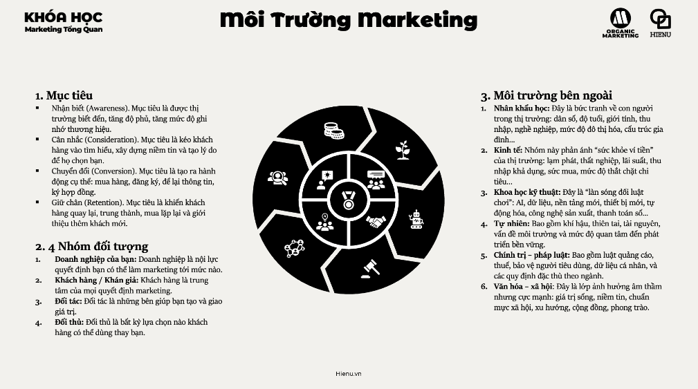
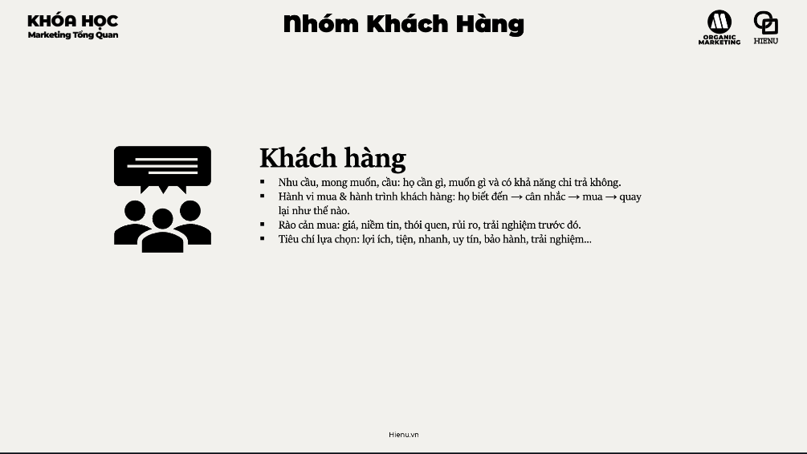
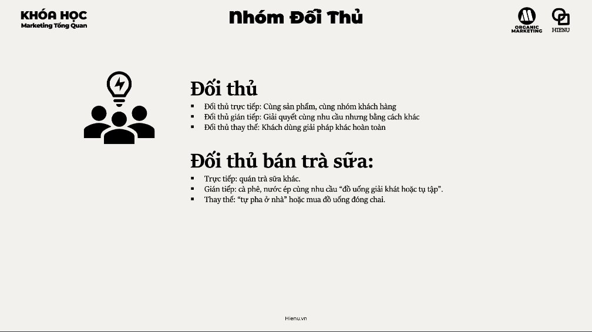

# Môi Trưởng marketing

## Mục tiêu

- [Mục tiêu](./2.Mục%20tiêu.md)

## Nhóm đối tượng

- [Doanh nghiệp của bạn](./3.Doanh%20nghiệp%20của%20bạn.md)

 

- [Khách hàng](./4.khách%20hàng.md)

 

- [Đối tác](./5.Đối%20tác.md)

 

- [Đói thủ](./6.Đối%20thủ.md)

## Môi trường bên ngoài
- [Nhân khẩu học](./7.Nhân%20khẩu%20học.md)
- [Kinh tế](./8.kinh%20tế.md)
- [khoa học kỹ thuật](./9.khoa%20học%20kỹ%20thuật.md)
- [Tự nhiên](./10.tự%20nhiên.md)
- [Chính trị pháp luật](./11.chính%20trị%20pháp%20luật.md)
- [Xã hội nhân văn](./12.xã%20hội%20nhân%20văn.md)