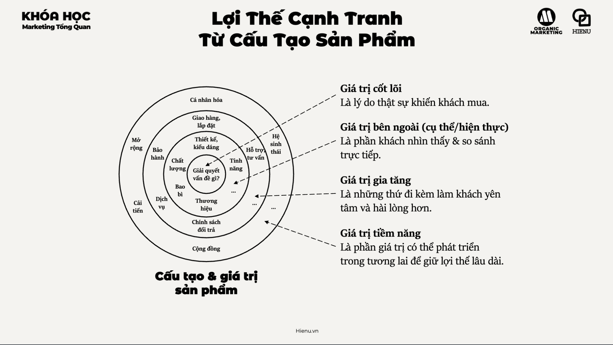

### Lợi Thế Cạnh Tranh Từ Giá Trị Sản Phẩm

# Lợi thế cạnh tranh từ giá trị sản phẩm

### Giá trị cốt lõi
- [Giá trị cốt lõi](./2.1%20Giá%20trị%20cốt%20lõi.md)

### Giá trị bên ngoài
- [Giá trị bên ngoài](./2.2%20Giá%20trị%20bên%20ngoài.md)

### Giá trị gia tăng
- [Giá trị gia tăng](./2.3%20Giá%20trị%20gia%20tăng.md)

### Giá trị tiềm năng
- [Giá trị tiềm năng](./2.4%20Giá%20trị%20tiềm%20năng.md)

---

Product value là nền tảng của mọi competitive advantage bền vững. Compete bằng quảng cáo, pricing, hay distribution mà không có product value tốt là "chơi game khó với tay không". Nhưng product value không phải một chiều — nó có nhiều tầng, và hiểu các tầng này giúp bạn tìm differentiation opportunity mà đối thủ chưa khai thác.

**Theodore Levitt** (Harvard Business School) phân chia Product Levels thành 4 tầng — model này vẫn cực kỳ practical đến ngày nay.

---

**4 Tầng Giá Trị Sản Phẩm:**

| Tầng | Định nghĩa | Ví dụ: Điện thoại |
|---|---|---|
| **Core Value (Giá trị cốt lõi)** | Benefit cơ bản nhất khách hàng thực sự mua | Kết nối liên lạc, chụp ảnh, giải trí |
| **External Value (Giá trị bên ngoài / Actual Product)** | Features, design, quality, brand name, packaging — thứ "bao ngoài" core benefit | Màn hình, camera specs, thiết kế, logo Apple/Samsung |
| **Added Value (Giá trị gia tăng / Augmented Product)** | Services và benefits phụ thêm làm differentiate | Bảo hành, AppleCare, ecosystem (iCloud, AirDrop), support |
| **Potential Value (Giá trị tiềm năng)** | Những gì có thể thêm vào trong tương lai để delight customers | AR capabilities, health sensors, AI features chưa có |

---

**Tại sao compete ở Core Value là race to the bottom:**

Nếu bạn compete ở Core Value — "điện thoại của tôi có thể gọi điện" — thì tất cả competitors cũng có. Không có differentiation = compete bằng giá = margin collapse.

**Ví dụ lịch sử:**
- Taxi truyền thống compete ở Core Value: đưa bạn từ A đến B
- Grab compete ở Added Value: biết giá trước, track driver, cashless, rating system, support
- Kết quả: Grab dominate dù Core Value y hệt

**Lesson**: Khi Core Value đã bị commodity hóa (mọi đối thủ đều có), competition moved đến External và Added Value.

---

**Tìm Competitive Advantage ở từng tầng:**

**Giá trị cốt lõi:** Định nghĩa lại core benefit
- Thay vì "chúng tôi bán cà phê" → "chúng tôi bán không gian làm việc và lifestyle" (Starbucks)
- Thay vì "chúng tôi bán bảo hiểm" → "chúng tôi bán peace of mind"
- *Opportunity*: khách hàng thực sự mua gì? Core benefit đó có thể được redefined không?

**Giá trị bên ngoài:** Differentiate ở design, quality, performance
- Không phải chỉ "tốt hơn" mà phải "khác biệt theo cách customer care"
- Apple differentiate ở design và UX — không phải specs
- *Opportunity*: dimension nào customer cares nhất mà bạn có thể be clearly best at?

**Giá trị gia tăng:** Win bằng ecosystem và service
- Amazon Prime: shipping + streaming + storage = leaving Prime is painful
- Grab ecosystem: ride + food + payment + shopping = daily utility
- *Opportunity*: service, guarantee, ecosystem nào có thể tạo ra stickiness?

**Giá trị tiềm năng:** Signal future và build excitement
- Tesla Autopilot software updates — car "gets better" over time
- *Opportunity*: roadmap nào có thể được communicated để build anticipation và loyalty?

---

**Ứng dụng cho SME Việt Nam:**

Với resource hạn chế, SME không thể compete ở mọi tầng. Strategy rõ ràng:

1. Identify tầng nào competitor KHÔNG invest nhiều
2. Pick một tầng và be clearly better ở đó
3. Communicate advantage đó trong messaging

*Ví dụ*: Một thương hiệu trà sữa SME không thể compete với Gong Cha ở External Value (brand, thiết kế). Nhưng có thể compete ở Added Value: loyalty program tốt hơn, customize order tốt hơn, tốc độ phục vụ nhanh hơn tại neighborhood.

> **Bài học:** Đừng try to compete ở tất cả các tầng — đó là game của các enterprise với budget lớn. Identify tầng nào bạn có thể be meaningfully better, invest vào đó, communicate rõ ràng. "Tốt hơn ở mọi thứ" không convincing — "tốt nhất cho X" thì convincing.

> **Phân tích sâu:** Theodore Levitt's famous insight: "People don't buy quarter-inch drills — they buy quarter-inch holes." Core Value là hole, không phải drill. Khi hiểu core value đúng, bạn thấy potential substitutes bạn chưa nghĩ đến và opportunities to differentiate ở levels cao hơn. Hilton không phải chỉ bán phòng ngủ — họ bán experience của "feeling special while traveling".

> **Sai lầm phổ biến #1:** Chỉ focus vào External Value (features, specs) và bỏ quên Added Value. Trong nhiều category, Added Value là thứ tạo ra loyalty — customer service, returns policy, onboarding experience. Customer bỏ một product tốt vì service kém.

> **Sai lầm phổ biến #2:** Communicate Core Value thay vì Added Value khi tất cả competitors đã có core value equivalent. "Chúng tôi cung cấp dịch vụ chất lượng cao" = nói về Core Value mà mọi competitor đều claim. Messaging phải đi sâu vào điều cụ thể làm differentiate ở Added Value level.

> **Cạm bẫy:** Invest nhiều vào Potential Value (hứa hẹn tương lai) mà neglect hiện tại — khiến customer expectation mismatch với current experience. Potential value chỉ có giá trị khi current value đã solid. Đừng pitch roadmap nếu core product chưa deliver.

---
