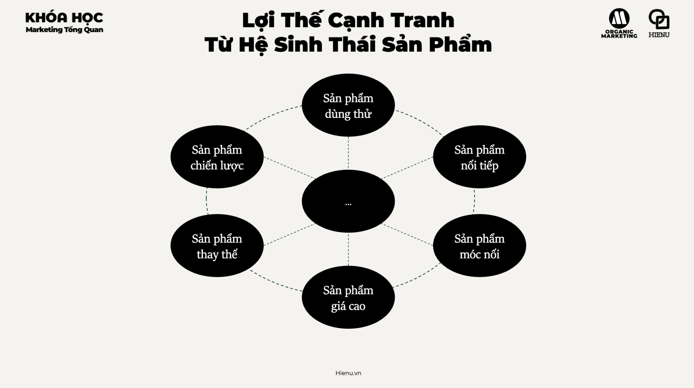
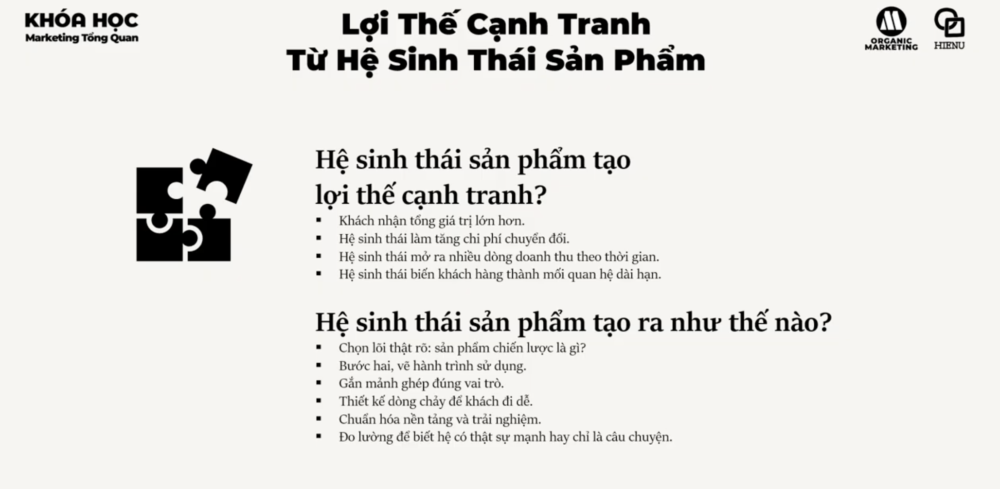

### Lợi Thế Cạnh Tranh Từ Hệ Sinh Thái

# Lợi thế cạnh tranh từ hệ sinh thái




## Lợi thế cạnh tranh từ hệ sinh thái
- [Lợi thế cạnh tranh từ hệ sinh thái](./5.1%20Lợi%20thế%20cạnh%20tranh.md)

## Lợi thế cạnh tranh tạo ra lợi nhuận
- [Lợi thế cạnh tranh tại ra lợi nhuận](./5.2%20Lợi%20thế%20cạnh%20tranh%20hệ%20sinh%20thái%20tạo%20ra%20biên%20lợi%20nhuận.md)

## Hệ sinh thái được tạo ra như nào
- [Hệ sinh thái được tạo ra như nào](./5.3%20Hệ%20sinh%20thái%20tạo%20ra%20nền%20tảng.md)

---

Ecosystem competitive advantage là một trong những moats bền vững nhất — khó copy, tạo ra switching costs cao, và cải thiện theo thời gian (network effects). Đây là lý do Apple, Grab, Masan, và nhiều platform businesses chi phối thị trường lâu dài dù bị cạnh tranh mạnh.

**Ecosystem = tập hợp các sản phẩm/dịch vụ liên kết tạo ra giá trị cho nhau và cho khách hàng, và giá trị tăng lên khi hệ sinh thái lớn hơn.**

---

**Tại sao Ecosystem tạo Competitive Advantage:**

**1. Network Effects (Hiệu ứng mạng lưới)**
Giá trị của sản phẩm tăng khi có nhiều user hơn. Hai loại:
- **Direct network effect**: Zalo hữu dụng hơn khi nhiều người dùng Zalo
- **Indirect network effect**: Shopee có nhiều sellers → buyer có nhiều lựa chọn → buyers tăng → sellers muốn vào → vòng lặp

*Implication*: First-mover có lợi thế nếu build network effects sớm. Đây là lý do "blitzscaling" — grow nhanh trước khi competitors có thể replicate network.

**2. High Switching Costs**
Khi khách hàng đã dùng nhiều sản phẩm trong ecosystem, cost of leaving cao:
- Apple: phone + laptop + iPad + AirPods + iCloud + Apple Watch → leaving Apple means replacing ALL
- Grab: GrabPay balance + GrabRewards points + linked bank account + favorite drivers → inertia

**3. Cross-selling Margin**
Mỗi touch point trong ecosystem là opportunity để upsell/cross-sell:
- GrabFood user → GrabMart → GrabFinancial → higher LTV (Customer Lifetime Value) per user
- Masan: thực phẩm → nước uống → retail (WinMart) → financial (Techcombank) → circular ecosystem

---

**Platform vs Product Business:**

| Dimension | Product Business | Platform Business |
|---|---|---|
| Value creation | Company tạo ra value | Users/Partners tạo value cho nhau |
| Scaling cost | Linear (scale = thêm cost) | Sub-linear (network grows faster than cost) |
| Moat | Product quality | Network effects + data |
| Ví dụ | Vinamilk, TH True Milk | Shopee, Grab, Facebook |

Platform businesses khó build nhưng khi reached critical mass, very hard to displace.

---

**Khi nào SME có thể build mini-ecosystem:**

Không phải mọi business đều cần platform scale. SME có thể build ecosystem ở mức nhỏ hơn:

**Level 1: Product + Service Bundle**
Salon + skincare products + membership → customer không chỉ đến cắt tóc, còn mua products và return vì membership

**Level 2: Partner Ecosystem**
Công ty tư vấn HR + công ty training + công ty recruitment software → giới thiệu lẫn nhau, tạo bundled solution → khó compete individually

**Level 3: Community + Product**
Brand thể thao build running community → events, Strava groups, challenges → product purchase becomes secondary to community membership

---

**Ví dụ: Grab Ecosystem tại Việt Nam**

```
GrabCar/Bike ─────────────────────── Transportation
       │
GrabFood ──────────────────────────── Delivery
       │                               ↕
GrabMart ──────────────────────────── Quick commerce
       │
GrabPay ───────────────────────────── Payments (drives all above)
       │
GrabFinancial ─────────────────────── Insurance, lending
       │
GrabRewards ───────────────────────── Lock-in via points
```

Mỗi service feed users vào services khác. GrabPay là glue — khi bạn top up tiền vào GrabPay, có incentive dùng tất cả services khác để spend số dư đó.

> **Bài học:** Ecosystem advantage không build overnight — cần strategy và patience. Nhưng khi built, nó là moat khó phá vỡ nhất. Key question cho bất kỳ business nào: "Chúng ta đang chỉ sell product lẻ, hay đang build a set of interlocking value?"

> **Phân tích sâu:** Geoffrey Parker, Marshall Van Alstyne, Sangeet Choudary (Platform Revolution) phân tích platform businesses qua lens của "core interaction" — thứ platform facilitate giữa producers và consumers. Successful platforms identify một core interaction có high value và remove friction cho interaction đó. Grab's core interaction: match driver với passenger. Khi core interaction proven, expand to adjacent interactions (food, payments, shopping).

> **Sai lầm phổ biến #1:** Try to build ecosystem quá sớm khi core product chưa solid. Amazon bán sách trước, perfected fulfillment logistics, THEN expanded. Đừng launch 5 products cùng lúc để "build ecosystem" — mỗi product cần win on its own trước khi ecosystem synergy có thể work.

> **Sai lầm phổ biến #2:** Nhầm lẫn "bundled products" với "ecosystem". Gộp nhiều thứ vào một package không phải ecosystem. Ecosystem cần genuine value creation giữa components — mỗi component make others more valuable, không chỉ sold together.

> **Cạm bẫy:** Platform chicken-and-egg problem. Platforms cần cả producers lẫn consumers để có value — nhưng producers sẽ không join nếu không có consumers, và consumers không join nếu không có producers. Solution: start with one side heavily subsidized (Grab subsidized drivers với bonuses sớm), or find multi-hats players (người vừa là producer vừa là consumer, như early Airbnb hosts cũng là travelers).

---
