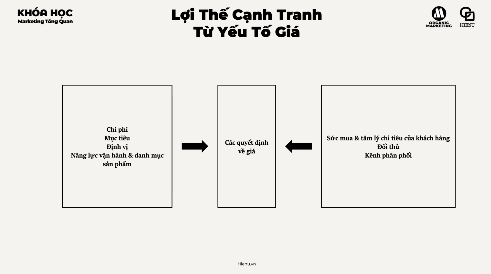
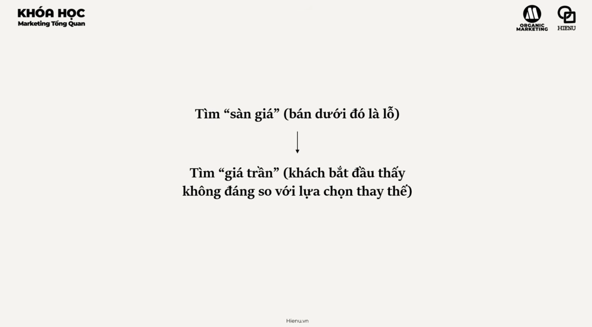

### Lợi Thế Cạnh Tranh Về Giá

# Tổng quan


## Lợi thế cạnh tranh về giá
- [Lợi thế cạnh tranh về giá ](./6.1%20Lợi%20thế%20cạnh%20tranh%20về%20giá.md)

## Định giá và chiến lược





- [Định giá và chiến lược](./6.3%20Định%20giá%20và%20chiến%20lược.md)

---

Price competitive advantage là khi bạn có thể offer mức giá thấp hơn đối thủ mà vẫn có profit — hoặc offer cùng mức giá nhưng được perceived là value tốt hơn. Đây là competitive dimension quen thuộc nhất nhưng cũng **nguy hiểm nhất** nếu không được xây dựng trên nền tảng cost structure thực sự.

**Quan trọng:** Price competitive advantage ≠ chỉ cần discount. Pricing strategy là một trong những lever mạnh nhất trong marketing — và cũng là thứ bị misused nhiều nhất.

---

**4 Chiến lược định giá chính:**

| Strategy | Logic | Phù hợp khi | Risk |
|---|---|---|---|
| **Cost-plus Pricing** | Cost + desired margin = price | Simple, predictable margin | Ignore customer willingness to pay — có thể underprice hoặc overprice |
| **Value-based Pricing** | Price = perceived value từ góc nhìn customer | Product có clear differentiated value, B2B | Cần research để hiểu WTP (Willingness to Pay) |
| **Competitive Pricing** | Benchmark vs competitor | Commodity markets, price-sensitive segments | Race to bottom nếu cả ngành theo |
| **Dynamic Pricing** | Price thay đổi theo demand, time, segment | Airlines, hotels, ride-hailing, eCommerce | Perceived as unfair nếu không transparent |

---

**Price Positioning — Tín hiệu Market Tier:**

Giá không chỉ là số tiền — nó là **signal** về quality và positioning:

| Price Tier | Signal | Strategy |
|---|---|---|
| **Premium** | "Tôi là best in class" | Apple, Hermès, Porsche — justify bằng quality, brand, exclusivity |
| **Mid-range** | "Best value for money" | IKEA, Honda — "đủ tốt ở mức giá hợp lý" |
| **Budget** | "Rẻ nhất có thể" | Xiaomi, generic brands — compete bằng cost efficiency |

**Sai lầm phổ biến**: Mid-range với price như Premium → confuse market. Hoặc Premium product nhưng discount heavily → destroy premium positioning.

---

**Khi nào Price CA là sustainable:**

Price advantage chỉ sustainable khi được built trên structural cost advantage — không phải chỉ margin sacrifice:

**Structural cost advantages:**
- **Economies of scale**: produce nhiều hơn → unit cost thấp hơn (Vinamilk vs SME dairy)
- **Operational efficiency**: Lean processes, automation — Zara fast fashion
- **Vertical integration**: Control chuỗi cung ứng → remove middlemen margin
- **Technology**: App-based operations thấp overhead hơn brick-and-mortar

Nếu không có structural cost advantage → price war = đốt tiền. Ai có vốn nhiều hơn win, không phải ai có strategy tốt hơn.

---

**Psychological Pricing Tactics:**

| Tactic | Example | Mechanism |
|---|---|---|
| **Charm pricing** | 99,000đ thay vì 100,000đ | Left-digit effect — người đọc "99" trước "100" |
| **Anchoring** | Gạch giá cũ 500k, giá mới 299k | Reference price tạo perceived deal |
| **Bundle pricing** | "3 tháng chỉ 199k" thay vì 66k/tháng | Reduces per-unit pain của payment |
| **Decoy pricing** | 3 options: nhỏ/vừa/lớn với giá tạo anchoring | Middle option seems "most reasonable" |
| **Price/quality signal** | Tăng giá → perceived quality tăng | Đặc biệt với search goods — wine, perfume |

---

**Đặt giá Value-based — quy trình:**

```
Bước 1: Hiểu alternatives của customer
         Họ đang trả bao nhiêu cho alternative hiện tại?

Bước 2: Quantify differentiating value
         Sản phẩm bạn save họ bao nhiêu tiền/thời gian/risk?

Bước 3: Set price = fraction of value delivered
         Rule of thumb: capture 10–30% của value bạn create

Bước 4: Test và adjust
         Price too high → low conversion; Price too low → leave money on table
         A/B test pricing nếu có volume
```

> **Bài học:** Đừng compete bằng giá trừ khi có structural cost advantage. Nếu không, price war chỉ destroy margin của cả ngành. Thay vào đó, find dimensions of value mà customer cares about và compete ở đó — sau đó price theo value delivered, không theo cost.

> **Phân tích sâu:** Michael Porter phân biệt hai generic strategies: Cost Leadership (be the lowest cost producer — Walmart, IKEA, Vietjet) và Differentiation (charge premium for unique value — Apple, Starbucks). "Stuck in the middle" — không rõ mình là Cost Leader hay Differentiator — thường underperform cả hai. Pricing strategy phải align với which generic strategy bạn chọn.

> **Sai lầm phổ biến #1:** Discount để acquire customers, với plan "raise price later". Khách hàng acquired ở low price có different price sensitivity — khi raise price, họ churn. Discount creates wrong type of customer loyalty (loyalty to price, not brand). Better: targeted promotion cho new customers với clear end date.

> **Sai lầm phổ biến #2:** Underpricing B2B products vì sợ lose deal. B2B buyers thường interpret low price as "low quality or desperate". Research shows many B2B buyers willing to pay more for vendors they trust. Underpricing signals desperation, not value. Có trường hợp tăng giá lại close more deals.

> **Cạm bẫy:** Giảm giá khi gặp competition thay vì invest vào differentiation. Giảm giá là phản xạ tự nhiên — nhưng một khi bắt đầu price war, rất khó stop. Each price cut signals to market that price is the main differentiator — invites more competitors to race to bottom. Alternative: "Why would a customer pay our price vs competitor?" — nếu không có good answer, fix that first.

---
