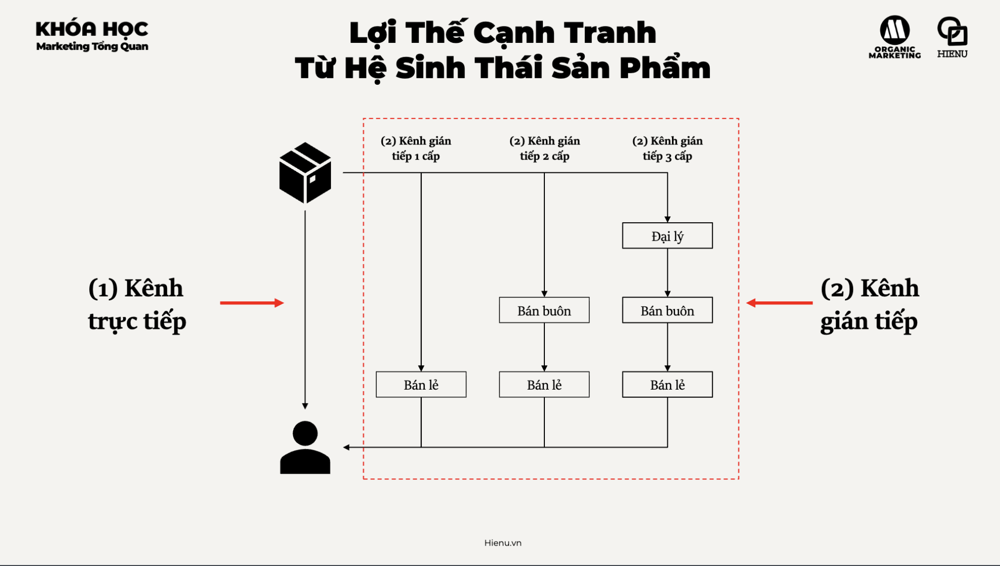
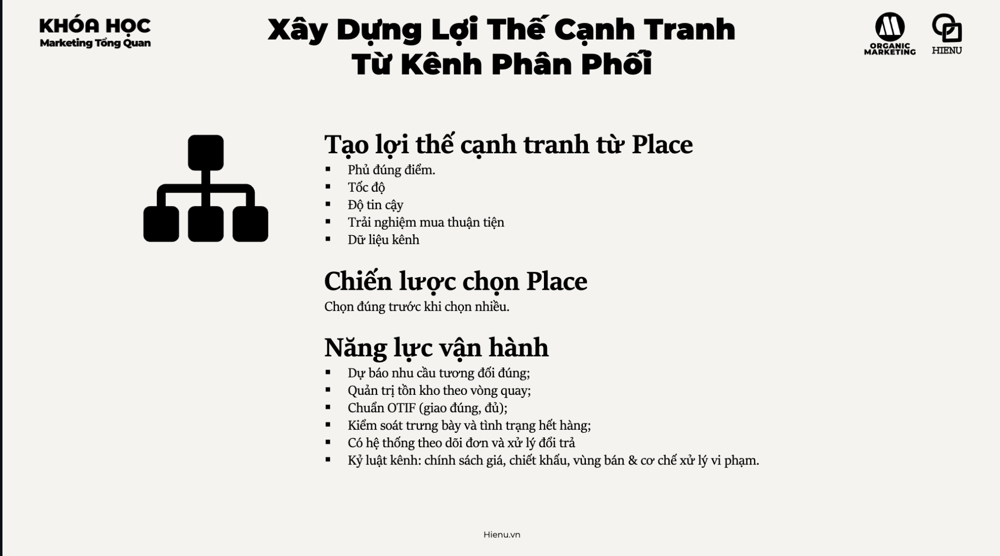
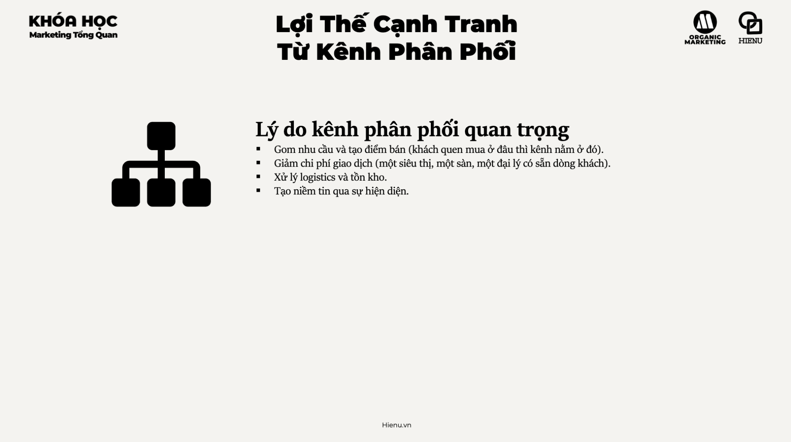
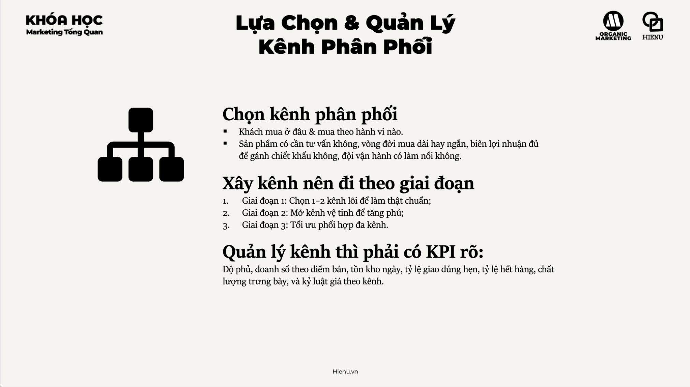

### Lợi Thế Cạnh Tranh Từ Kênh Phân Phối (Place)

# Tổng quan

## Kênh phân phối
- [Kênh phân phối](./7.1%20Kênh%20phân%20phối.md)

## Giá trị của kênh phân phối

- [Giá trị của kênh phân phối](./7.2%20Giá%20trị%20của%20kênh%20phân%20phối.md)

## Chức năng và vai trò của kênh phân phối

- [Chức năng và vai trò của kênh phân phối](./7.3%20Chức%20năng%20và%20vai%20trò%20của%20kênh%20phân%20phối.md)

## Chọn kênh - Xây kênh - Quản lý

- [Chọn kênh - Xây kênh - Quản lý](./7.4%20Chọn%20kênh%20-%20xây%20kênh%20-%20quản%20lý%20kênh%20.md)

---

Distribution (Place) là một trong 4P trong marketing mix — và cũng là P bị underestimated nhất. Nhiều business tập trung vào product và promotion mà quên rằng **"ai bán ở đâu và như thế nào" có thể là competitive moat lớn không kém gì sản phẩm tốt**.

Masan Consumer dominate FMCG Việt Nam không chỉ vì sản phẩm tốt — mà vì distribution network 300,000+ điểm bán trên toàn quốc, kể cả vùng sâu vùng xa mà competitors không reach được.

---

**Các loại kênh phân phối:**

| Loại | Mô tả | Ví dụ | Phù hợp khi |
|---|---|---|---|
| **Direct (Trực tiếp)** | Manufacturer → Customer không qua trung gian | DTC brands, Apple Store, website | Muốn control experience, margin cao, B2B |
| **Indirect - 1 cấp** | Manufacturer → Retailer → Customer | FMCG qua siêu thị | Cần scale nhanh, retailer có sẵn audience |
| **Indirect - 2 cấp** | Manufacturer → Distributor → Retailer → Customer | Hàng tiêu dùng truyền thống | Cần geographic reach rộng |
| **Hybrid** | Kết hợp direct và indirect | Nike: own stores + third-party retailers | Muốn control premium segment, reach mass market |

---

**Tradeoffs: Direct vs Indirect Channel**

| Dimension | Direct | Indirect |
|---|---|---|
| **Margin** | Cao hơn (không chia với middleman) | Thấp hơn (phải share margin) |
| **Speed to scale** | Chậm (phải build everything) | Nhanh hơn (leverage existing network) |
| **Customer data** | Own all data | Limited visibility |
| **Brand control** | Complete | Partial |
| **Upfront cost** | Cao | Thấp |
| **Best for** | Premium brands, high-touch sales | Mass market, low-margin products |

---

**Distribution as Competitive Moat:**

Kênh phân phối tạo moat khi:
1. **Hard to replicate**: build network 5 năm → competitor cần 5 năm để catch up
2. **Creates switching costs**: retailer/distributor đã tích hợp vào hệ thống → không muốn switch
3. **Network effects**: nhiều sản phẩm trong cùng distribution network → cost sharing → cho phép offer giá thấp hơn

**Ví dụ Việt Nam — Masan Consumer:**
- 300,000+ điểm bán từ siêu thị (WinMart) đến tạp hóa vùng nông thôn
- New product launch có thể immediately available nationwide
- Competitor phải build distribution hoặc negotiate với cùng những retailers đó — tốn nhiều năm và tiền

---

**Omnichannel vs Multichannel:**

| Concept | Multichannel | Omnichannel |
|---|---|---|
| Định nghĩa | Bán qua nhiều kênh độc lập | Nhiều kênh integrated, seamless experience |
| Customer experience | Khác nhau ở mỗi kênh | Nhất quán và complement nhau |
| Data | Siloed per channel | Unified customer view |
| Ví dụ | Website riêng, Shopee riêng, cửa hàng riêng | Đặt online, pickup tại store; return online order tại store |

Omnichannel đòi hỏi technology và operational alignment nhưng create significantly better customer experience và higher LTV.

---

**Khi nào xây kênh riêng vs dùng kênh người khác:**

**Xây kênh riêng (DTC) khi:**
- Product cần high-touch explanation (demo, consultation)
- Muốn own customer relationship và data
- Margin đủ cao để support cost of DTC
- Brand positioning cần curated experience

**Dùng kênh sẵn có khi:**
- Cần scale nhanh với capital ít
- Product là commodity (không cần explanation)
- Target market đã buy on specific platform (Shopee, Tiki)
- Testing market trước khi invest vào own channel

> **Bài học:** Distribution strategy là long-term decision — thay đổi kênh khi đã scale là painful và expensive. Invest thời gian upfront để chọn đúng channel mix, thay vì chỉ follow trend hoặc làm theo cách dễ nhất lúc đầu.

> **Phân tích sâu:** Michael Porter's Value Chain phân tích activities tạo ra value, bao gồm Outbound Logistics và Sales/Marketing. Distribution nằm ở intersection của hai activities này và often where the most value is captured or lost. Ví dụ: book publisher tạo ra content nhưng Amazon capture phần lớn value vì kiểm soát distribution. Platform power comes from distribution control.

> **Sai lầm phổ biến #1:** Over-reliance vào một kênh duy nhất. Business phụ thuộc 80% vào Shopee/Facebook → algorithm thay đổi hoặc policy update → revenue drop dramatically. Diversify channels không phải vì "nice to have" mà là risk management.

> **Sai lầm phổ biến #2:** Conflict giữa direct và indirect channel không được manage. Launch DTC website trong khi distributor đang sell sản phẩm → distributor không happy, có thể drop product. Channel conflict phải được anticipated và managed với clear territory/pricing rules.

> **Cạm bẫy:** Chọn channel dựa trên cái bạn thích, không phải cái customer dùng. "Chúng ta sẽ chỉ bán trên website" — nhưng target customer mua qua Shopee và đọc review trước. Channel strategy phải follow customer's buying behavior, không phải business preference.

---
