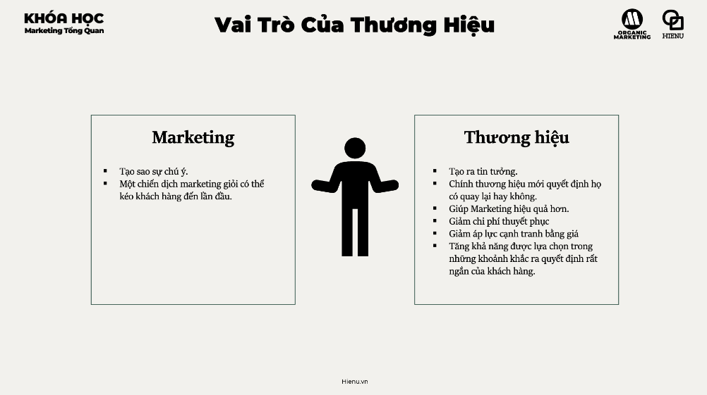

### Định Vị Thương Hiệu (Brand Positioning)

# Định vị thương hiệu



---

Brand positioning là **quyết định bạn muốn brand của mình được nhớ đến như thế nào trong tâm trí của target customer** — so với đối thủ cạnh tranh. Không phải tagline, không phải logo — mà là position bạn occupy trong mind space của customer.

Al Ries và Jack Trout: *"Positioning is not what you do to a product. It is what you do to the mind of the prospect."*

---

**3 Khái niệm cần phân biệt:**

| Khái niệm | Định nghĩa | Controlled by |
|---|---|---|
| **Brand Identity** | Thứ bạn muốn brand của mình là — vision, values, personality, visual system | Brand/company |
| **Brand Image** | Thứ customers thực sự perceive về brand | Customers |
| **Brand Positioning** | Strategic decision về position bạn muốn own trong market, relative to competitors | Brand/company (but validated by customers) |

Khoảng cách giữa Brand Identity (what you intend) và Brand Image (what customers perceive) = execution gap. Marketing giỏi là closing gap này.

---

**Positioning Statement Formula:**

```
For [target customer]
who [has this need / faces this problem],
[Brand name] is the [competitive frame/category]
that [key benefit / differentiating claim]
because [reason to believe].
```

**Ví dụ:**
```
For urban professionals in Vietnam (25–40)
who want premium coffee in a comfortable workspace,
Highlands Coffee is the coffee chain
that delivers consistent quality with welcoming, productive spaces
because of carefully sourced Vietnamese coffee and
150+ prime urban locations open from early morning.
```

Positioning Statement không phải tagline — đây là **internal strategic document** định hướng mọi marketing decision. Tagline là cách diễn đạt positioning cho public.

---

**Cách xây dựng Positioning:**

**Bước 1: Know your target**
Positioning tốt start từ deep understanding của specific target segment — không phải "mọi người".

**Bước 2: Know the competitive frame**
Competitive frame là category bạn compete trong (và category quyết định alternatives mà customer so sánh bạn với):
- Grab positioned trong "ride-hailing" → compare với xe ôm, taxi
- Grab positioned trong "super app" → different set of competitors

**Bước 3: Identify differentiating benefit**
Điều gì bạn làm tốt hơn alternatives một cách meaningful với target customer?
- Tốt hơn ở tất cả mọi thứ → không convincing
- Tốt hơn ở điều quan trọng nhất với target segment → positioning

**Bước 4: Reason to Believe (RTB)**
Tại sao customer nên tin vào claim của bạn? RTB có thể là:
- Feature/specification (verifiable proof)
- Credentials (awards, certifications, years of experience)
- Customer testimonials / social proof
- Process transparency ("made in Vietnam with 100% arabica")

---

**Competitive Positioning Map:**

Visualize positioning bằng cách chọn 2 dimensions quan trọng nhất với target segment và plot competitors:

```
Example: Coffee market Vietnam

        Price
        HIGH
         │     ● Starbucks
         │          ● The Coffee House
         │  ● Highlands
         │              ● Phúc Long
Atmosphere ───────────────────────────── Convenience
BASIC                                    FOCUSED
         │          ● Trung Nguyên
         │  ● cà phê vỉa hè
        LOW
```

White space trên map = potential positioning opportunity mà chưa ai occupy.

---

**Ví dụ Positioning Việt Nam:**

| Brand | Positioning | Target | Core Message |
|---|---|---|---|
| **Highlands Coffee** | Premium-accessible Vietnamese coffee + workspace | Urban professionals | "Không gian làm việc, cà phê chất lượng" |
| **Trung Nguyên Legend** | Authentic Vietnamese coffee heritage | Coffee enthusiasts, nationalistic | "Khơi nguồn sáng tạo, tự hào hương vị Việt" |
| **Starbucks VN** | Global premium coffee experience | Affluent, aspirational, international vibe | Status, experience, "third place" |
| **Phúc Long** | Premium tea + coffee, authentic Vietnamese | Quality-conscious, tea lovers | Tea heritage meets modern cafe |

Mỗi brand occupy different position → không compete directly dù cùng category.

---

**Khi nào cần Reposition:**

- Market shift: target segment thay đổi values (sustainability trend)
- Competitor move vào position của bạn
- Brand image drift xa Brand Identity mà bạn intend
- Expand sang new segment và cần new positioning
- Brand được perceived là outdated hoặc irrelevant

Reposition là risky — brand có brand equity trong position cũ. Phải careful không lose existing customers while attracting new ones.

> **Bài học:** Position rõ ràng không phải "exclude" customers — nó là **tạo ra strong association** với một segment để trở thành top-of-mind khi họ cần. Khi someone thinks "cần tư vấn luật lao động" → có một brand xuất hiện ngay không? Đó là power of strong positioning.

> **Phân tích sâu:** Ries và Trout (Positioning: The Battle for Your Mind, 1981) argue rằng market là "battle of perceptions, not products." Người dùng Coca-Cola và Pepsi trong blind taste test thích Pepsi nhiều hơn — nhưng market share Coke cao hơn vì stronger brand perception. Positioning works on perception layer, not product layer. Implication: positioning investment (consistent messaging over time) có compounding returns — stronger perception = easier future marketing.

> **Sai lầm phổ biến #1:** Positioning bị driven bởi internal perspective ("chúng tôi nghĩ mình là...") thay vì validated bởi customer perception. Test positioning với actual customers: "Khi nhắc đến [brand], điều đầu tiên bạn nghĩ đến là gì?" Nếu answer không match intended positioning → gap cần fix.

> **Sai lầm phổ biến #2:** Thay đổi positioning quá thường xuyên. Positioning cần time để sink vào perception của market. Trung bình cần 2–3 năm consistent messaging để establish strong positioning. Many brands change direction every 12 months → never occupy clear position in customer mind.

> **Cạm bẫy:** Positioning too broad để try to appeal to everyone. "Chúng tôi phục vụ tất cả khách hàng với dịch vụ tốt nhất" → occupy no position in anyone's mind. Narrow positioning paradox: the more specific you position, the stronger the association, and often the LARGER the effective market reach — because people recommend you precisely when someone needs exactly what you offer.

---
