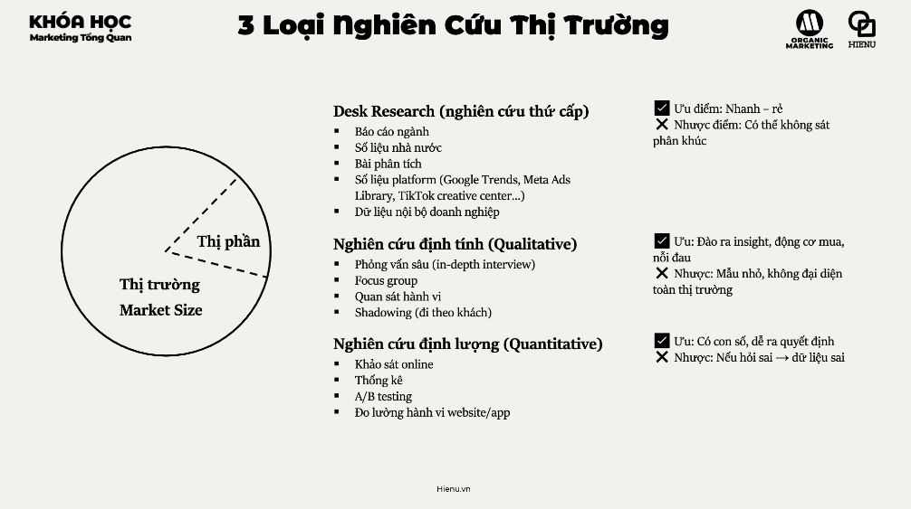
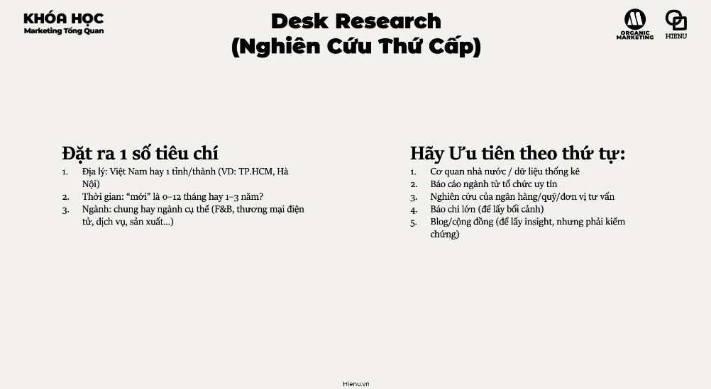

### Nghiên Cứu Thị Trường

# Nghiên cữu thị trường


<br>

- [Cơ hội thị trường](./1.Cơ%20hội%20thị%20trường.md)
- [Nghiên cứu khách hàng](./3.Nghiên%20cứu%20khách%20hàng.md)
- [Nghiên cứu dối thủ](./4.Nghiên%20cứu%20đối%20thủ.md)
- [Nghiên cứu sản phầm && giải pháp](./5.Nghiên%20cứu%20sản%20phẩm%20hoạc%20giải%20pháp.md)
- [Rủi ro và quyết định](./6.Rủi%20ro%20và%20quyết%20định.md)


# 3 Loại Nghiên cứu thị trường
- 


<br>

- [Desk Research - Nghiên cứu thứ cấp](./7.Desk%20Research.md)
- [Qualitative - Nghiên cứu định tính](./8.Qualitative.md)
- [Quantitative - Nghiên cứu định lượng](./9.Qantitative.md)

# Desk Research
- 

---

Market research bị skip không phải vì người ta không biết nó quan trọng — mà vì nó bị hiểu sai là **"tốn kém, mất thời gian, và cho kết quả không chắc chắn"**. Thực tế: market research tốt không cần nhiều tiền, và chi phí không research thường cao hơn rất nhiều.

Mục đích cốt lõi: **giảm risk của quyết định marketing và business** bằng cách thay assumptions bằng evidence.

---

**5 lĩnh vực cần research:**

| Lĩnh vực | Câu hỏi cần trả lời | Output |
|---|---|---|
| **Cơ hội thị trường** | Market có đủ lớn không? Đang grow hay shrink? Có white space không? | Go/No-go decision |
| **Khách hàng** | Ai mua? Tại sao mua? Quy trình ra quyết định như thế nào? | Persona, messaging strategy |
| **Đối thủ** | Ai đang compete? Điểm mạnh/yếu? Positioning của họ? | Differentiation strategy |
| **Sản phẩm/Giải pháp** | Product-market fit chưa? Feature nào quan trọng nhất? | Product roadmap priority |
| **Rủi ro** | Điều gì có thể sai? Regulatory risk? Technology risk? | Risk mitigation plan |

---

**3 loại research — khi nào dùng loại nào:**

**Desk Research (Nghiên cứu thứ cấp)**
→ Dùng existing data: báo cáo ngành, government statistics, competitor websites, press releases, review platforms
→ Khi nào: LUÔN làm đầu tiên — nhanh và gần như free
→ Hạn chế: data có thể outdated, không specific cho context của bạn

**Qualitative Research (Định tính)**
→ In-depth interviews, focus groups, user observation
→ Khi nào: cần hiểu WHY — tại sao khách hàng behave như vậy, pain points thực sự là gì
→ Sample size: nhỏ (5–15 người) nhưng deep; không phải đại diện thống kê mà đại diện insight
→ Hạn chế: không thể generalize, interviewer bias

**Quantitative Research (Định lượng)**
→ Surveys, A/B testing, analytics data, sales data
→ Khi nào: cần validate hypothesis từ qualitative ("có bao nhiêu % người cảm thấy như vậy?")
→ Sample size: đủ lớn để statistical significance
→ Hạn chế: tốn kém nếu primary; survey có response bias

---

**Minimum Viable Research cho SME (không có budget lớn):**

```
Week 1: Desk Research
- Google Trends cho category
- Top 3 competitor: website, pricing, reviews trên Google Maps/Facebook
- Industry report tóm tắt (thường có free version)
- Facebook/Zalo groups của target audience → đọc posts và comments

Week 2: Qualitative (5–8 người)
- Nói chuyện với 5–8 người thuộc target segment
- Không pitch product — chỉ hỏi về current behavior và pain points
- Câu hỏi mẫu: "Lần gần nhất bạn [behavior liên quan], bạn làm gì? Điều gì khiến bạn bực bội nhất? Bạn đang dùng gì hiện tại?"

Week 3: Validate với data nhỏ
- Tạo landing page đơn giản và chạy 1–2 triệu ads để test messaging
- Hoặc survey 50–100 người trong network với 5 câu hỏi cụ thể
- Đo click rate, conversion rate — đây là demand signal thực tế nhất
```

---

**Research ≠ Confirmation**

Sai lầm phổ biến: research để confirm idea đã có. Đây là confirmation bias disguised as research.

Research tốt phải có khả năng cho kết quả "đừng làm" — nếu bạn không sẵn sàng pivot hoặc stop dựa trên findings, research đó không meaningful.

Câu hỏi trước khi bắt đầu research: **"Nếu kết quả là X, tôi sẽ làm gì khác?"** Nếu câu trả lời là "không gì cả" → research đó không đáng làm.

> **Bài học:** Market research không phải luxury của large corporation — đây là risk management cho mọi business. Cost của bad research (confirmation bias, leading questions) thường còn cao hơn không research vì nó tạo ra false confidence.

> **Phân tích sâu:** Clayton Christensen's "Jobs to be Done" framework suggest rằng tốt nhất không nên hỏi "bạn muốn sản phẩm nào?" (người ta không biết) mà hỏi "bạn đang trying to accomplish gì? Điều gì cản trở bạn?" Câu hỏi về behavior và obstacle reveals Jobs-to-be-Done tốt hơn câu hỏi về preference. Ví dụ: Henry Ford: "Nếu hỏi người ta muốn gì, họ sẽ nói 'con ngựa nhanh hơn'."

> **Sai lầm phổ biến #1:** Hỏi người trong network thay vì actual target customers. "Bạn bè tôi đều thích ý tưởng này" — nhưng họ không phải khách hàng, và họ không muốn làm bạn tổn thương. Tìm người không biết bạn và hỏi họ honestly.

> **Sai lầm phổ biến #2:** Dừng research sau khi đã có data ủng hộ. Research là ongoing process — khi market thay đổi, khi competitor thay đổi, insights cũ có thể trở nên outdated. Đặc biệt: customer pain points thay đổi khi alternatives trong market cải thiện.

> **Cạm bẫy:** Qualitative research rất dễ bị biased bởi cách đặt câu hỏi. "Bạn có muốn tính năng X không?" → 90% sẽ nói có (acquiescence bias). Đúng hơn phải hỏi: "Kể cho tôi nghe về lần gần nhất bạn gặp vấn đề [liên quan]" → để họ tự kể, không suggest answer. Kỹ thuật: NEVER đề cập đến product của bạn trong phase discovery interview.

---
