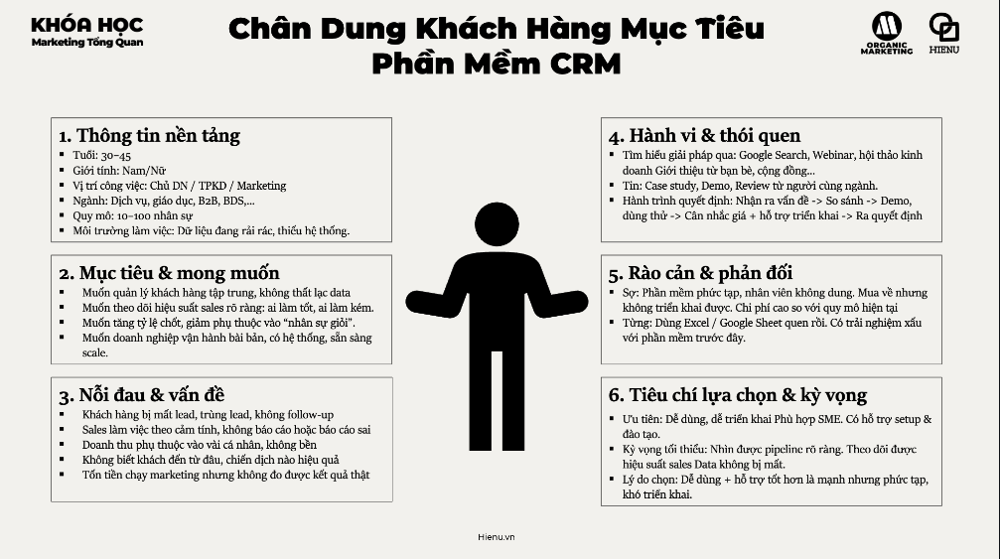
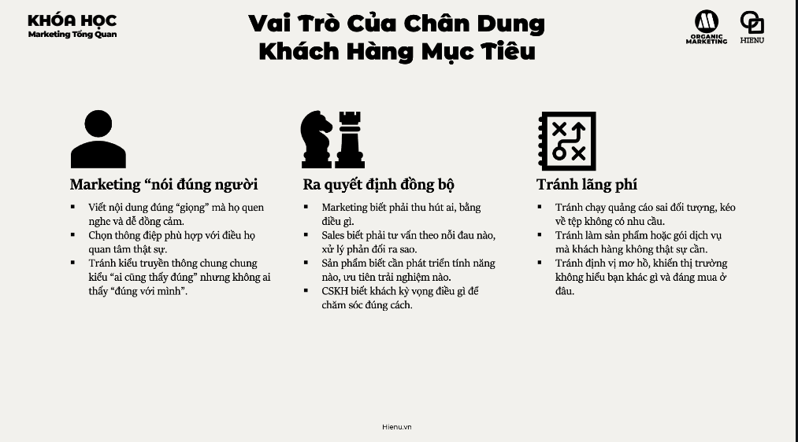

### Chân Dung Khách Hàng (Customer Persona)

# Chân dung khách hàng


<br>



<br>



---

Customer Persona (hay Buyer Persona) là **bản mô tả bán hư cấu về khách hàng lý tưởng** — được xây dựng từ research và data thực, không phải imagination. "Bán hư cấu" vì persona là một archetype đại diện cho một nhóm, không phải một người thực cụ thể.

**Persona ≠ Target Segment:**
- Target Segment: "Phụ nữ 25–35 tuổi, thu nhập trung–cao, Hà Nội" (demographic)
- Persona: "Chị Thu, 29 tuổi, Marketing Manager tại startup, làm việc 10 tiếng/ngày, lo lắng về work-life balance, muốn self-improvement nhưng không có thời gian, consume content trên Instagram lúc 10–11pm, không trust quảng cáo nhưng trust recommendation từ người trong ngành"

Persona chứa **context và psychology** — thứ segment không có. Đây là điều tạo ra messaging thực sự resonates.

---

**Persona phải có những gì:**

| Thành phần | Nội dung | Tại sao cần |
|---|---|---|
| **Demographics cơ bản** | Tuổi, giới tính, vị trí địa lý, nghề nghiệp, thu nhập | Context filter — ai là người này? |
| **Goals & Motivations** | Họ muốn achieve gì? Điều gì drive họ? | Messaging phải speak to aspiration |
| **Pain Points** | Frustrations, challenges, obstacles | Sản phẩm giải quyết pain — phải biết pain là gì |
| **Behaviors** | Mua hàng ở đâu? Consume content ở đâu? Research như thế nào? | Channel selection và content format |
| **Objections** | Lý do họ KHÔNG mua — lo lắng, skepticism, alternatives | Address objections trong sales và marketing |
| **Information Sources** | Trust ai? Đọc gì? Follow ai? | Influencer và channel strategy |
| **Buying Decision Process** | Ai quyết định? Ai influence? Timeline? | B2B đặc biệt quan trọng |

---

**Jobs-to-be-Done lens:**

Ngoài persona demographics, framework Jobs-to-be-Done (Clayton Christensen) hỏi:
**"Khách hàng 'hire' sản phẩm của bạn để làm gì?"**

Milkshake example nổi tiếng: McDonald's research thấy 40% milkshake bán vào buổi sáng. Khách hàng không mua milkshake vì ngon — họ "hire" nó để fill long boring commute mà không làm bẩn tay. Job = "entertain me during commute + keep me full till lunch". Insight này lead đến product improvement hoàn toàn khác so với "làm ngon hơn".

**Câu hỏi JTBD để interview:**
- "Lần gần nhất bạn [hành vi liên quan đến product category], chuyện gì đã trigger nó?"
- "Trước đó bạn đang dùng gì? Tại sao switch?"
- "Điều tốt nhất và tệ nhất về giải pháp hiện tại của bạn?"

---

**Persona dựa trên data, không phải imagination:**

| Persona tốt | Persona kém |
|---|---|
| Dựa trên 10+ in-depth interviews với actual customers | Dựa trên assumption của team |
| Quotes thực từ customers ("Tôi ghét phải..." / "Điều tôi cần nhất là...") | Paraphrase chung chung |
| Behaviors observed (analytics, purchase data) | Behaviors assumed |
| Updated khi market thay đổi | Làm một lần rồi để đó |
| 2–3 personas đại diện segment khác nhau | 1 persona "trung bình" không represent ai |

---

**Template tạo Persona nhanh (B2C):**

```
Tên persona: [Đặt tên thật — VD: "Anh Minh"]
Tuổi: [X] | Nghề: [X] | Thu nhập: [X] | Sống ở: [X]

DAILY LIFE: [Ngày điển hình của họ trông như thế nào?]

GOALS: [Họ muốn gì trong cuộc sống/công việc?]

FRUSTRATIONS: [Điều gì khiến họ bực bội liên quan đến category này?]

HOW THEY BUY: [Research → Decision → Purchase — quy trình như thế nào?]

WHERE TO FIND THEM: [Platform, content type, thời gian online]

KEY QUOTE: ["[Quote thực từ interview đại diện cho mindset của persona]"]

WHY THEY'D BUY FROM YOU: [Specific reason]
WHY THEY WOULDN'T: [Specific objection]
```

> **Bài học:** Persona không phải deliverable để hoàn thành và để vào drawer. Persona là living document được dùng mọi lúc: "Anh Minh có đọc email không?" / "Message này có resonate với Chị Thu không?" / "Chúng ta có đang solve đúng pain point của họ không?" Nếu team không dùng persona hàng ngày → persona đó vô dụng.

> **Phân tích sâu:** Google's research "The Zero Moment of Truth" chỉ ra rằng average consumer ngày nay research qua 10.4 sources trước khi mua — so với 5.3 sources năm 2010. Persona phải reflect information journey này: họ research ở đâu, trust ai, so sánh cái gì. B2C persona needs to map "consideration journey", B2B persona cần map cả "buying committee" (ai research, ai influence, ai sign-off).

> **Sai lầm phổ biến #1:** Tạo persona demographics-only. "Phụ nữ 28 tuổi, có con nhỏ, thu nhập 20M" — thông tin này không đủ để viết một message, chọn một channel, hay design một offer. Need psychological depth: motivations, fears, reference groups, aspirations.

> **Sai lầm phổ biến #2:** Một persona cho tất cả. Thực tế một product thường có 2–4 distinct buyer types với motivations khác nhau. Cùng một sản phẩm bảo hiểm nhân thọ được mua bởi "người lo lắng cho gia đình" và "người muốn tax advantage" — messaging hoàn toàn khác nhau, channel khác nhau.

> **Cạm bẫy:** Fictional persona không dựa trên research. Team ngồi brainstorm "khách hàng của chúng ta là ai?" → tạo persona từ imagination → marketing campaign miss. Fix: trước khi tạo persona, phải có ít nhất 5 in-depth customer conversations, actual purchase data review, và social listening data.

---
