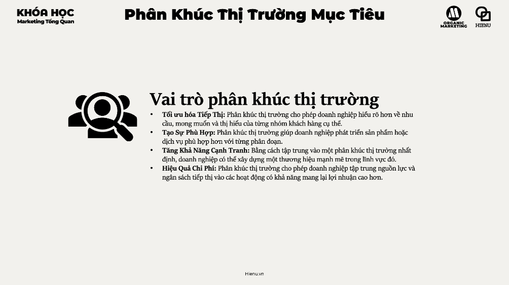
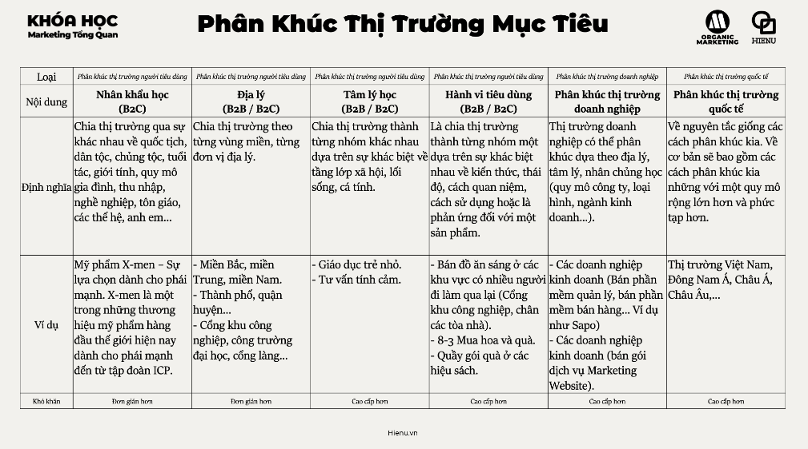

### Phân Khúc Thị Trường (Market Segmentation)

# Vai trò của phân khúc thị trường


# Phân khúc thị trường mục tiêu



## Nhân khẩu học
- [Nhân khẩu học](./2.Nhân%20khẩu%20học.md)

## Địa ly
- [Địa lý](./3.Địa%20lý.md)

## Tâm lý học
- [Tâm lý học](./4.Tâm%20lý%20học.md)

## Hành vi mục tiêu
- [Hành vi mục tiêu](./5.Hành%20vi%20tiêu%20dùng.md)

## Phân khúc thịt trường
- [Phân khúc thị trường](./5.Phân%20khúc%20thị%20trường%20doanh%20nghiệp.md)


## Thị trường quốc tế
- [Thị trường quốc tế](./6.Phân%20khúc%20quốc%20tế.md)

---

Market segmentation là nền tảng của marketing strategy: bạn không thể phục vụ tốt cho tất cả mọi người cùng lúc. Segmentation giúp xác định **nhóm người nào có đặc điểm và nhu cầu tương đồng** để bạn có thể design offer và message phù hợp nhất cho họ — thay vì dùng một generic approach cho tất cả.

**Segmentation không phải là "loại bỏ" khách hàng — đây là "tập trung nguồn lực có hạn vào nơi hiệu quả nhất".**

---

**4 Tiêu chí của một Segment tốt (MASA):**

| Tiêu chí | Giải thích | Ví dụ |
|---|---|---|
| **Measurable** (Đo được) | Có thể định lượng size và purchasing power | "Phụ nữ 25–40 tuổi ở TP.HCM" = measurable; "Người thích thứ đơn giản" = không measurable |
| **Accessible** (Tiếp cận được) | Có thể reach và serve được bằng marketing channels | Segment online → có thể reach qua Facebook/Google; Segment offline rural → cần kênh khác |
| **Substantial** (Đủ lớn) | Đủ lớn để sinh profit khi serve | Niche quá nhỏ → không đủ revenue |
| **Actionable** (Có thể hành động) | Có thể design effective programs cho segment đó | Segment rõ ràng đủ để customize offer và message |

---

**4 Cách phân khúc chính:**

**1. Nhân khẩu học (Demographic Segmentation)**
Dễ measure nhất: tuổi, giới tính, thu nhập, trình độ học vấn, nghề nghiệp, gia đình
→ Dùng khi: product có target user rõ ràng theo demographic
→ Hạn chế: hai người cùng demographic có thể có behavior hoàn toàn khác

**2. Địa lý (Geographic Segmentation)**
Vị trí: quốc gia, tỉnh/thành, khu vực (urban/rural), climate
→ Dùng khi: product/service khác biệt theo vị trí, hoặc distribution limited
→ Ví dụ: F&B chain ở TP.HCM vs Hà Nội có menu và messaging khác nhau

**3. Tâm lý học (Psychographic Segmentation)**
Lifestyle, values, interests, personality, social class
→ Dùng khi: product relate đến identity hoặc lifestyle
→ Ví dụ: cùng income level nhưng một người ưu tiên trải nghiệm, người kia ưu tiên tiết kiệm

**4. Hành vi (Behavioral Segmentation)**
Purchase behavior: tần suất mua, loyalty level, usage rate, benefits sought, buyer readiness stage
→ Dùng khi: product có diverse use cases hoặc customer lifecycle quan trọng
→ Ví dụ: Shopee segment theo "heavy buyers" và retarget với different offers vs "lapsed users"

---

**STP — từ Segmentation đến Action:**

```
Segmentation → Targeting → Positioning

1. SEGMENT: Chia market thành các nhóm có đặc điểm tương đồng
   (Dùng 4 tiêu chí trên)

2. TARGET: Chọn segment nào để focus
   Tiêu chí chọn: size/growth, profitability, competitive intensity,
   company fit (strengths, resources)

3. POSITION: Xác định bạn muốn được perceived như thế nào
   trong tâm trí của target segment đó
```

**Chiến lược targeting phổ biến:**
- **Concentrated** (Niche): 1 segment, full focus → phù hợp SME với resource hạn chế
- **Differentiated** (Multi-segment): serve nhiều segment với different offers → cần nhiều resource
- **Undifferentiated** (Mass market): cùng offer cho tất cả → chỉ work khi product là commodity

---

**B2B Segmentation — khác B2C:**

| Dimension | B2C | B2B |
|---|---|---|
| Tiêu chí segment | Demographic, psychographic, behavior | Industry, company size, revenue, geography, buying process |
| Decision maker | Cá nhân hoặc household | Committee (CEO, finance, IT, end user) |
| Relationship cycle | Ngắn hơn, frequent small purchases | Dài hơn, ít deals lớn hơn |
| Key segment variable | Lifestyle và motivations | Firmographics + buying stage |

> **Bài học:** Segmentation không phải chỉ làm một lần. Market thay đổi, new segments emerge, old segments shrink. Revisit segmentation ít nhất 1 lần/năm — đặc biệt khi có product launch mới, khi thấy acquisition cost tăng, hoặc khi existing customers churn nhiều hơn expected.

> **Phân tích sâu:** Kotler phân biệt Mass Marketing (Ford Model T — "mọi người có thể có bất cứ màu nào miễn là màu đen") với Segment Marketing (customize cho từng nhóm) và Niche Marketing (focus vào sub-segment rất cụ thể). Xu hướng hiện tại đang đi về phía Micro-segmentation và Personalization — nhờ data, có thể segment at individual level (segment of one). Nhưng với SME, 2–3 well-defined segments thực sự serve vẫn better hơn 10 segments vague.

> **Sai lầm phổ biến #1:** Segment theo demographic nhưng ignore behavior và psychographic. Hai người cùng "35 tuổi, thu nhập 30M, Hà Nội" có thể có totally different motivations và buying behavior. Behavior segmentation (đặc biệt: purchase history, usage patterns) thường predictive hơn demographic.

> **Sai lầm phổ biến #2:** Target quá nhiều segments cùng lúc với limited resource. "Chúng ta target tất cả mọi người" = không target ai cả. Rule of thumb cho startup/SME: chọn 1 primary segment, nắm chắc nó, sau đó mới expand.

> **Cạm bẫy:** Segment dựa trên data bạn đang có, không phải data bạn cần. Nếu chỉ có demographic data → segment theo demographic và bỏ qua psychographic. Nhưng psychographic thường predict behavior tốt hơn. Invest vào research để có behavioral và psychographic data — không chỉ rely on data bạn đang có.

---
