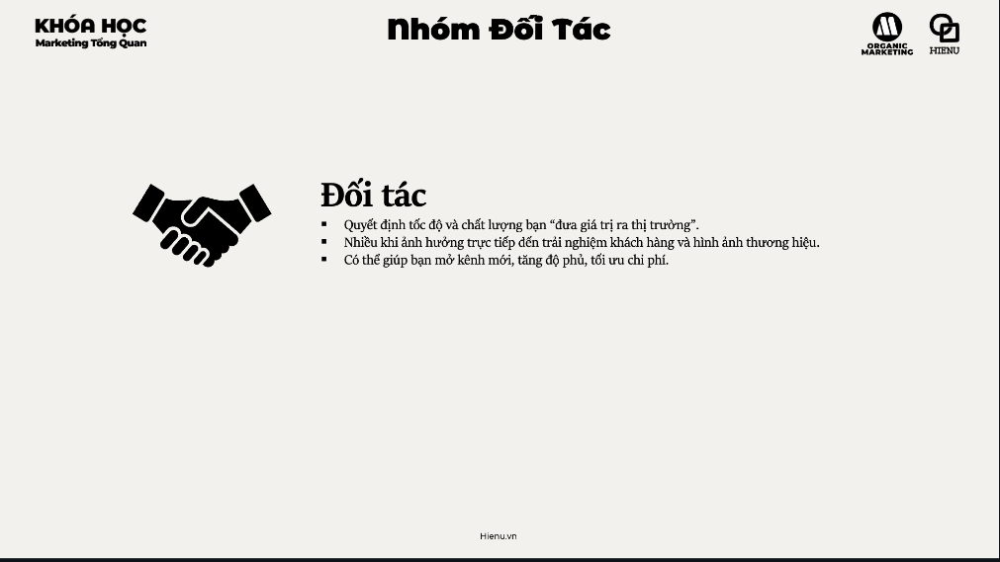

### Môi Trường Marketing (Marketing Environment)

# Môi Trưởng marketing


## Mục tiêu

- [Mục tiêu](./2.Mục%20tiêu.md)

## Nhóm đối tượng

- [Doanh nghiệp của bạn](./3.Doanh%20nghiệp%20của%20bạn.md)

<br>


- [Khách hàng](./4.khách%20hàng.md)

<br>


- [Đối tác](./5.Đối%20tác.md)

<br>


- [Đói thủ](./6.Đối%20thủ.md)

## Môi trường bên ngoài
- [Nhân khẩu học](./7.Nhân%20khẩu%20học.md)
- [Kinh tế](./8.kinh%20tế.md)
- [khoa học kỹ thuật](./9.khoa%20học%20kỹ%20thuật.md)
- [Tự nhiên](./10.tự%20nhiên.md)
- [Chính trị pháp luật](./11.chính%20trị%20pháp%20luật.md)
- [Xã hội nhân văn](./12.xã%20hội%20nhân%20văn.md)

---

Marketing không tồn tại trong chân không. Mọi quyết định marketing — pricing, channel, messaging, product — đều bị ảnh hưởng bởi môi trường xung quanh. **Marketing environment scan** là việc hiểu landscape này trước khi lên strategy, để tránh lên plan trong điều kiện lý tưởng mà không apply vào thực tế.

Môi trường marketing có hai tầng: **Micro environment** (gần, có thể tác động trực tiếp) và **Macro environment** (xa hơn, không kiểm soát được nhưng phải adapt).

---

**Micro Environment (Môi trường vi mô) — Ảnh hưởng trực tiếp:**

| Yếu tố | Câu hỏi cần trả lời | Tác động đến marketing |
|---|---|---|
| **Công ty của bạn** | Strengths/weaknesses? Resources? Culture? | Internal constraints cho strategy |
| **Khách hàng** | Ai? Needs gì? Behavior thay đổi thế nào? | Cốt lõi của mọi marketing decision |
| **Đối tác/Suppliers** | Ai supply? Reliability? Power balance? | Supply chain risk affect product quality và pricing |
| **Đối thủ** | Ai compete? Positioning của họ? Moves tiếp theo? | Differentiation và competitive response |
| **Công chúng/Stakeholders** | Media, community, regulators có influence gì? | Reputation management, PR strategy |

**Tool cho Micro Environment: Porter's 5 Forces**
Competitive rivalry / Threat of new entrants / Bargaining power of buyers / Bargaining power of suppliers / Threat of substitutes

---

**Macro Environment (Môi trường vĩ mô) — Không kiểm soát, phải adapt:**

**PESTLE Framework:**

| Factor | Câu hỏi | Ví dụ Việt Nam |
|---|---|---|
| **Political** (Chính trị) | Chính sách nào affect ngành? Regulatory risk? | Quy định quảng cáo, thuế nhập khẩu, FDI policy |
| **Economic** (Kinh tế) | GDP growth? Inflation? Consumer spending? | Lãi suất ảnh hưởng mortgage → real estate marketing thay đổi |
| **Social** (Xã hội) | Demographic trends? Cultural shifts? Values? | Gen Z value authenticity hơn → influence marketing strategy |
| **Technological** (Công nghệ) | New tech disrupt industry không? Digital adoption rate? | TikTok phá vỡ cách brands communicate |
| **Legal** (Pháp lý) | Luật nào applicable? Consumer protection? IP? | Nghị định 13/2023 về bảo vệ dữ liệu cá nhân → affect email marketing |
| **Environmental** (Môi trường) | Sustainability trend? Climate risk? | Consumer preference shift sang green products |

---

**Tần suất nên scan Marketing Environment:**

| Loại | Tần suất | Trigger để scan ngay |
|---|---|---|
| Macro (PESTLE) | 6–12 tháng / lần | Chính sách mới, economic shock (COVID, lạm phát), tech disruption |
| Micro/Competitor | 3–6 tháng / lần | Competitor launch sản phẩm mới, pricing change, new entrant |
| Customer behavior | Ongoing + quarterly deep dive | Sales dip unexplained, customer complaints tăng |

---

**Cách scan environment không tốn nhiều tiền:**

```
Macro (PESTLE):
- Google Alerts cho industry keywords
- Theo dõi Vietnambiz, CafeF cho economic signals
- Đọc industry association reports (VBA, VNBA, VRA...)
- Social listening: topics nào đang nổi trong target audience?

Micro (Competitor):
- Visit competitor websites hàng tháng
- Monitor competitor Facebook/Instagram pages
- Check Google Maps reviews của competitor
- Mystery shopping 2 lần/năm
- Theo dõi LinkedIn của competitor's employees (hiring signals)
```

---

**Ví dụ: Grab phải adapt Macro Environment Việt Nam**

| PESTLE Factor | Reality | Grab's Response |
|---|---|---|
| Political | Regulatory uncertainty cho ride-hailing 2014–2017 | Heavy lobbying, pilot programs, "công nghệ kết nối" framing |
| Economic | Cash-heavy economy, low credit card penetration | GrabPay đi kèm GrabExpress, accept tiền mặt lâu dài |
| Social | Người dùng lo ngại thông tin cá nhân | Hiển thị tên + ảnh tài xế, rating system |
| Technological | Smartphone adoption rapid | Mobile-first completely |
| Legal | Taxi regulations 2016 draft | Active participation in policy discussions |

> **Bài học:** Không có marketing strategy nào "tốt tuyệt đối" — chỉ có strategy tốt trong một specific environment. Environment thay đổi → strategy phải thay đổi. Scan environment không phải một lần khi lập plan — đây là ongoing intelligence gathering.

> **Phân tích sâu:** PESTLE scan đặc biệt quan trọng ở Việt Nam vì environment thay đổi nhanh hơn nhiều nước phát triển: smartphone adoption tăng tốc, middle class expanding, regulatory landscape masih evolving, và consumer values đang shift đáng kể giữa Gen X/Millennial/Gen Z. Brand lên plan 3 năm mà không rescan environment có thể thấy toàn bộ assumptions đã outdated sau 12 tháng.

> **Sai lầm phổ biến #1:** Chỉ scan competitor (micro) mà ignore macro trends. Blockbuster tập trung vào beating local video rental competitors — nhưng macro tech trend (streaming, internet) là thứ thực sự kill họ. Macro environment often contains bigger threats và opportunities than direct competitors.

> **Sai lầm phổ biến #2:** Scan environment nhưng không update strategy. Findings từ environment scan phải link đến action: "Trend X đang nổi → chúng ta sẽ làm Y". Nếu scan không dẫn đến decision hay adjustment → waste of time.

> **Cạm bẫy:** Overwhelm bởi quá nhiều data từ macro environment. Không phải mọi PESTLE factor đều relevant equally. Filter bằng cách hỏi: "Factor này có thể affect revenue, cost, hoặc customer behavior của chúng ta trong 12–24 tháng không?" Nếu không → note nhưng không act. Focus vào 2–3 factors có impact cao nhất.

---
