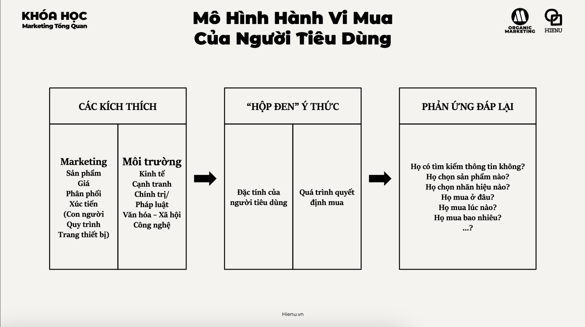
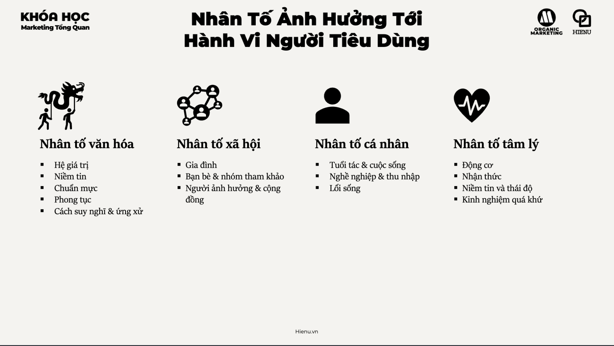

### Hành Vi Của Người Tiêu Dùng (Consumer Behavior)

# Hành vi của ngừoi tiêu dùng


# Nhân tố ảnh hưởng tới ngừoi tiêu dùng


- [Nhân tố văn hoá](./2.Nhân%20tố%20văn%20hoá.md)
- [Nhân tố xã hội](./3.Nhân%20tố%20xã%20hội.md)
- [Nhân tố cá nhân](./4.Nhân%20tố%20cá%20nhân.md)
- [Nhan tố tâm lý](./5.Nhân%20tố%20tâm%20lý.md)

---

Consumer behavior là nghiên cứu về **tại sao và như thế nào người ta ra quyết định mua hàng**. Không phải "ai mua" (demographic) — mà là cơ chế bên trong dẫn đến hành động mua.

Biết target segment là "phụ nữ 28 tuổi" không giúp bạn viết message tốt. Biết rằng "họ sợ bị judge bởi bạn bè" và "họ trust recommendation từ blogger hơn quảng cáo" → mới viết được message đúng và chọn đúng channel.

---

**Consumer Behavior "Black Box" Model:**

```
STIMULI                    BLACK BOX                    RESPONSE
(Marketing + Environment)  (Buyer's Mind)               (Purchase Decision)

Product/Price/Place/       ┌─────────────────┐          What to buy?
Promotion                  │ Characteristics  │          When to buy?
                    ──→    │ of the buyer     │ ──→      How much to buy?
Economy/Tech/              │                  │          Where to buy?
Political/Cultural         │ Decision process │
                           └─────────────────┘
```

Marketing chỉ control được Stimuli — không control được Black Box. Nhưng marketing tốt là hiểu Black Box đủ để influence decision process.

---

**4 Nhân tố ảnh hưởng đến Consumer Behavior:**

**1. Văn hóa (Cultural Factors)**
Tầng ảnh hưởng rộng nhất và deep nhất:
- **Culture**: values và beliefs cơ bản của xã hội — người Việt trọng sĩ diện, family-oriented, skeptical về advertising
- **Subculture**: Gen Z vs Millennial, Bắc vs Nam, nông thôn vs thành thị — mỗi nhóm có norms khác nhau
- **Social Class**: không chỉ về income mà về lifestyle, values, và aspiration

*Marketing implication*: sản phẩm "giúp bạn thành công" resonate khác nhau với người Hà Nội và người TP.HCM — vì định nghĩa "thành công" của hai culture khác nhau.

**2. Xã hội (Social Factors)**
- **Reference Groups**: nhóm người có ảnh hưởng đến attitudes và behavior (bạn bè, đồng nghiệp, KOLs)
- **Family**: family là reference group mạnh nhất — đặc biệt trong culture Á Đông
- **Roles & Status**: người ta mua để signal status trong role của họ (manager mua Mercedes không chỉ vì xe tốt)

*Marketing implication*: Social proof và influencer marketing work vì reference group effect. "5 triệu người dùng" hay "được Kim Lý dùng" tận dụng social factor.

**3. Cá nhân (Personal Factors)**
- Age & Life cycle stage: người độc thân mua khác couple có con nhỏ
- Occupation: marketer mua tools khác lawyer mua tools
- Economic situation: discretionary income ảnh hưởng category và brand tier
- Lifestyle: AIO (Activities, Interests, Opinions) — hai người cùng income có lifestyle spending khác nhau
- Personality & Self-concept: người ta mua brand reflect self-image của họ

**4. Tâm lý (Psychological Factors)**
- **Motivation** (Maslow's Hierarchy): need cơ bản (food, safety) vs need cao hơn (esteem, self-actualization) → khác category, khác messaging
- **Perception**: cùng sản phẩm được perceived khác nhau tùy framing (selectivity, distortion, retention)
- **Learning**: experience và exposure tạo ra buying habits
- **Beliefs & Attitudes**: "điện thoại Trung Quốc chất lượng kém" là belief → marketing Xiaomi ở Việt Nam phải overcome belief này

---

**Buyer Decision Process (5 bước):**

```
1. Problem Recognition → "Tôi cần/muốn X"
        ↓
2. Information Search → Hỏi bạn bè, Google, YouTube, review sites
        ↓
3. Evaluation of Alternatives → So sánh options dựa trên criteria
        ↓
4. Purchase Decision → Chọn và mua (có thể bị interrupt bởi others' opinions)
        ↓
5. Post-Purchase Behavior → Satisfied? → Repeat + Recommend / Dissatisfied? → Return + Complain
```

Marketing phải influence ở từng bước:
- Bước 1: Brand awareness để được nghĩ đến khi problem arise
- Bước 2: SEO/content để xuất hiện khi research
- Bước 3: Reviews, comparison content, demos
- Bước 4: Remove friction, strong CTA, reassurance
- Bước 5: After-sales support để tạo repeat và referral

---

**Ví dụ: Mua laptop cho sinh viên — 4 nhân tố**

| Nhân tố | Influence |
|---|---|
| Văn hóa | Apple được coi là "brand của người sáng tạo và thành công" — strong aspiration |
| Xã hội | Bạn bè trong ngành dùng gì? Giảng viên recommend gì? |
| Cá nhân | Budget, major (IT cần GPU mạnh, business chỉ cần word processing), aesthetic preference |
| Tâm lý | Sợ mua nhầm, motivated bởi "cần công cụ tốt để học tốt" |

> **Bài học:** Consumer behavior không rational — nó bị driven bởi layers of cultural, social, personal, và psychological factors, nhiều cái unconscious. Marketing giỏi không phải present features logic — mà phải speak to underlying motivations và address hidden concerns.

> **Phân tích sâu:** Daniel Kahneman's "Thinking, Fast and Slow" phân biệt System 1 (fast, intuitive, emotional) và System 2 (slow, deliberate, rational). Most consumer decisions — kể cả B2B — bị influenced nặng bởi System 1. "Does this feel right?" thường override "Is this the optimal choice?". Implication: emotional resonance trong marketing (storytelling, visual branding, social proof) often more effective than feature lists và logical arguments.

> **Sai lầm phổ biến #1:** Assume khách hàng decide rationally. Nhiều B2B marketers nghĩ "chúng tôi chỉ cần prove ROI" — nhưng CFO cũng bị ảnh hưởng bởi reference groups (peer companies dùng gì?), trust và relationship (đã biết vendor này chưa?), risk aversion (cái mới nếu fail thì ai blame?). Rational + Emotional đều cần.

> **Sai lầm phổ biến #2:** Ignore post-purchase behavior. Marketing thường stop ở purchase. Nhưng post-purchase satisfaction là source của repeat business và referrals — hai cái có CAC = 0. Invest vào onboarding, support, và follow-up là marketing investment với ROI cao.

> **Cạm bẫy:** Over-simplify consumer behavior với one-size-fits-all model. Behavior khác nhau không chỉ giữa demographics mà còn giữa purchase occasions. Cùng một người mua cà phê khác nhau cho "uống sáng một mình" (mua vỉa hè rẻ) vs "gặp gỡ đối tác" (Highlands hoặc cafe đẹp). Same person, same need, different context → different behavior. Map behavior theo occasion, không chỉ theo person.

---
